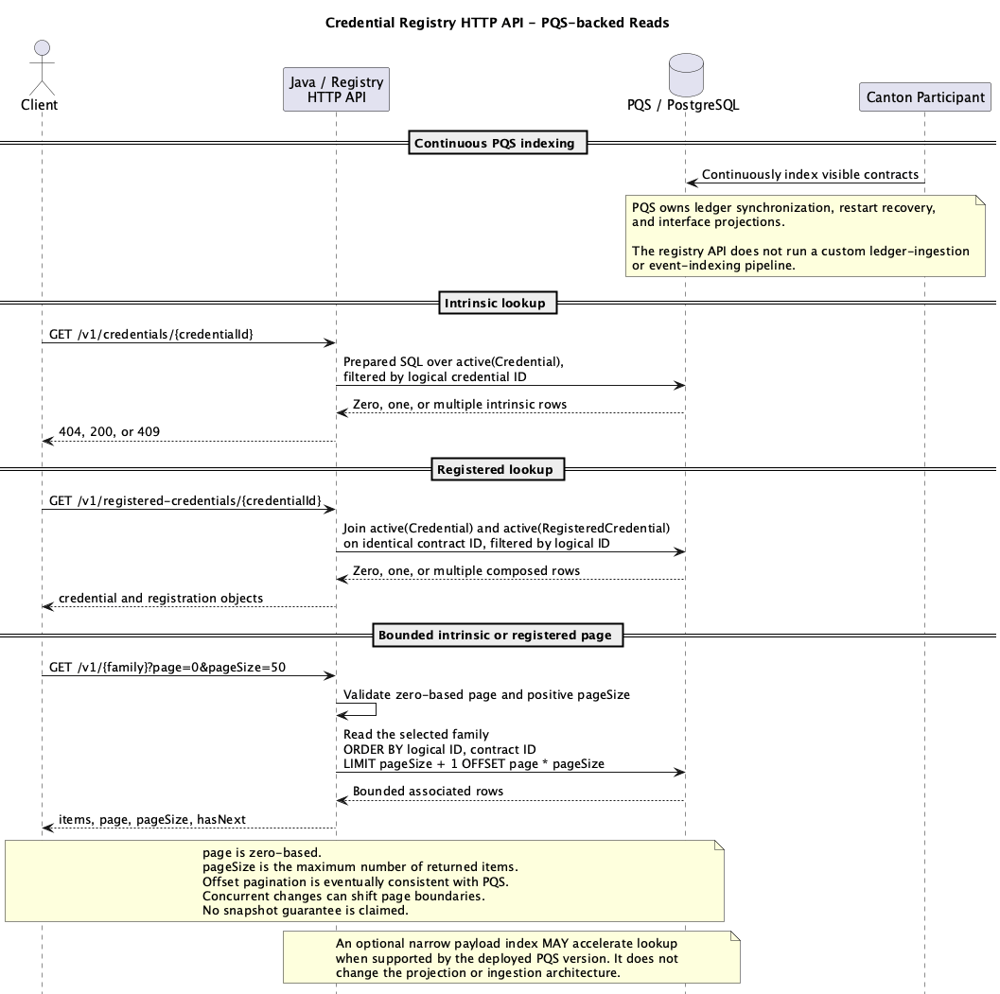
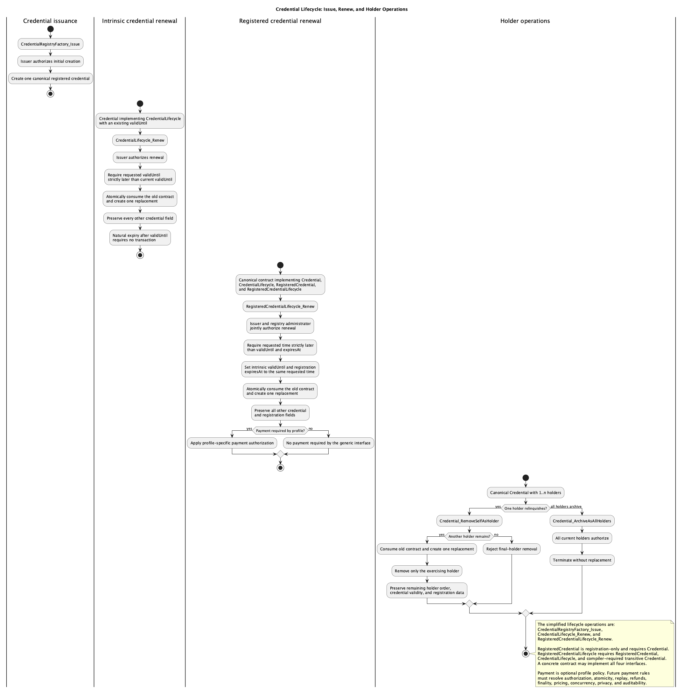
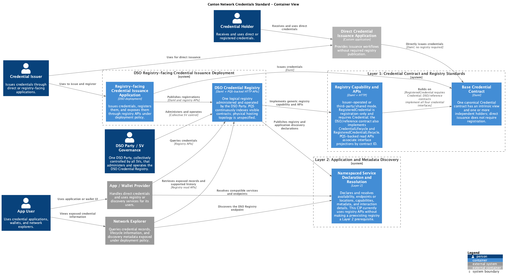

<pre>
  CIP: CIP TBD
  Layer: Daml
  Title: Canton Network Credentials Standard
  Author:
    Simon Meier
  License: CC0-1.0
  Status: Early Draft (comment threads at the bottom of this doc, and inlined TODO notes)
  Type: Standards Track
  Created: 2026-01-09
</pre>

# Canton Network Credentials Standard

## Abstract

Define a portable base credential contract standard, a credential registry interface and API standard built on that base, and a DSO-governed shared-registry deployment profile for storing, retrieving, discovering, and using registered credentials on the Canton Network.

## Specification

This CIP consists of two generic layers, presented in dependency order:

1. **Credential Contract and Registry Standards** defines two distinct surfaces:
   * the **Base Credential Contract Standard**, for intrinsic credentials that can exist and be used without a registry; and
   * the **Credential Registry Interface and API Standard**, a registry capability built on the base interface, with registry-specific metadata and lifecycle operations plus access-policy-neutral read-only HTTP APIs for exposed credential records. A conforming registry keeps its backend and APIs within the same responsibility boundary so consumers do not depend on its storage implementation.
2. **Application and Metadata Discovery** standardizes discoverable declarations for applications and services, including credential registries. Through namespaced properties on credential subjects, these declarations describe what is available, where its endpoints are, which capabilities or metadata it supports, and how clients interact with it. Layer 2 defines how a client that knows an identity, party, or application context can find compatible services and the information needed to invoke them. This CIP uses the Credential Registry Interface and API Standard as the current mechanism for publishing and resolving the declarations, while registries themselves can be discoverable services. The off-ledger Asset Registry API discovery requirements in CIP-56 inform this layer's reusable discovery mechanism.

The standard supports three deployment modes:

* **direct-issued Credential without a registry:** an issuer-specific workflow creates a contract implementing the base `Credential` interface without requiring a registry or registry HTTP API;
* **issuer-operated registry:** the issuer, or infrastructure it controls, adds the registry capability and APIs; and
* **third-party or shared registry:** a separate administrator registers credentials for issuers and holders under its own registry policy.

### Architecture Overview (Non-Normative)

The System Context view treats the Canton Network Credentials Standard as one system and shows only its people and external-system relationships. Internal interfaces and deployment components are intentionally deferred to the Container view. Credential issuance remains the responsibility of issuer-specific software. Issuance applications can support direct workflows without registry publication or can add registration and HTTP exposure under deployment-defined access policy. Issuers identify the assessment policy under which they issue credentials. App Users use both app or wallet providers and network explorers as separate applications: wallets may support holder workflows, while explorers consume credential records and history exposed to them by a deployment. Using an explorer does not imply ledger Party authority. Issuers and holders may also use these applications. Entities may act in multiple roles. For example, a bank can issue credentials to its customers while also holding credentials issued to it by regulators.


*System Context for the Canton Network Credentials Standard and its external actors. [C4-PlantUML source](images/credentials-system-context.puml).*

The System Context is a simplification that separates direct issuance from registry-facing issuance for clarity; these labels describe roles, not required deployment boundaries or Layer 1 access classifications. One issuance application or registry-facing deployment may implement either capability or both. Each deployment defines whether and how credential records are exposed, including filtering, authentication, authorization, and audience.

The System Context elements below identify the people and external systems shown in the diagram.

| Element | Type | Diagram role or boundary |
| --- | --- | --- |
| Credential Issuer | Person | Organization or individual acting in the issuer role. |
| Credential Holder | Person | Party acting in the holder role. |
| App User | Person | User of credential applications, wallets, and network explorers; using an explorer does not imply ledger Party authority. |
| Canton Network Credentials Standard | System | The single in-scope system for portable credentials, registration, discovery, and the DSO deployment profile. |
| Direct Credential Issuance Application | External system | Issuer-specific software for issuance and holder workflows without required registry publication. |
| Registry-facing Credential Issuance Application | External system | Issuer-specific software that adds registration or HTTP exposure; the promoted DSO deployment profile is a concrete instance. |
| App / Wallet Provider | External system | Application or wallet that handles credentials for issuers, holders, and app users. |
| Network Explorer | External system | Explorer that consumes credential records, lifecycle information, and discovery metadata exposed to it under deployment policy. |
| DSO Party / SV Governance | Person | The DSO Party, collectively controlled by all SVs, acting as administrator and operator of the DSO Credential Registry. |

#### Credential Registry Reference Application (DSO-managed)

This CIP also promotes a DSO-managed Credential Registry reference application that applies both generic layers through one logical Credential Registry. The diagram separates public and private issuance capabilities for clarity. A single application may provide either capability or both. An issuance application uses the reference application but remains a distinct application component. The later DSO Credential Registry Deployment Profile defines its concrete deployment as one logical Credential Registry, administered and operated by a single DSO Party under the collective control of all SVs. The profile adds DSO-specific governance, registration expiry, fees, discovery, and endpoint publication. Implementations may expose the registry through multiple endpoints while preserving the same registry identity and governance model.

This is the initial DSO deployment profile. Future iterations may define additional deployment models, including delegated operation or partitioning.

### Layer 1: Credential Contract and Registry Standards

Layer 1 defines Daml interfaces for the base `Credential`, `RegisteredCredential`, and `CredentialRegistryFactory`, and HTTP interfaces for registry information, lookup, and bulk retrieval. Credential Lifecycle relates intrinsic validity, registration lifecycle, and archival or removal behavior. A base credential can exist without registration.

#### Daml Interfaces

The three candidate Daml interfaces are `Credential`, `RegisteredCredential`, and `CredentialRegistryFactory`. Their candidate definitions are checked in at [`demo/interface/daml/Canton/Network/Credentials/V1.daml`](demo/interface/daml/Canton/Network/Credentials/V1.daml), with candidate status and build instructions in [`demo/interface/README.md`](demo/interface/README.md); concrete templates, package naming for standardization, and signatories remain outside that source.

##### Credential Interface

A base credential represents issuer assertions about one or more credential subjects. The fields oriented toward the [W3C Verifiable Credentials Data Model 2.0](https://www.w3.org/TR/vc-data-model-2.0/) form the basis of `CredentialView`:

- credential identifier;
- credential types;
- issuer;
- credential subjects;
- validity interval.

Holders are separate Canton operational metadata.

Field position and explicit Daml authority keep identity and operational roles independent:

- issuer identity identifies the entity making assertions and does not imply holder status or Canton authorization;
- credential subjects identify who or what claims concern when an ID is present; a Party subject does not become a holder, controller, or authorized actor;
- Canton operational holders are explicitly listed Parties; holder status does not imply subject or issuer identity;
- controllers and authorization come from explicit interface choices and template authority, not generic payload inference.

In practice, clients use the typed fields according to their declared roles, and templates authorize operations explicitly. Implementations MUST NOT scan credential identifiers, claims, nested `AnyValue`, or other payload content to infer subjects, holders, controllers, or authorization.

**Table 1. Core `CredentialView` fields**

  | CredentialView field | W3C VC Data Model 2.0 concept | External serialization | Canton semantics |
  | --- | --- | --- | --- |
  | `CredentialView.id : Optional Text` | Credential [`id`](https://www.w3.org/TR/vc-data-model-2.0/#identifiers) | Profile-defined URL when present | Semantic correspondence; the Daml value requires profile mapping. |
  | `CredentialView.credentialTypes : [Text]` | W3C [`type`](https://www.w3.org/TR/vc-data-model-2.0/#types) | Serialize as JSON-LD `type` values | A W3C-exportable representation MUST include `VerifiableCredential` among the values. |
  | `CredentialView.issuer : W3C_VC_Identifier` | [`issuer`](https://www.w3.org/TR/vc-data-model-2.0/#issuer) | Identifier selected by the ADT variant | Issuer identity retains its field-specific role. |
  | `CredentialView.validFrom : Optional Time`; `CredentialView.validUntil : Optional Time` | [`validFrom`, `validUntil`](https://www.w3.org/TR/vc-data-model-2.0/#validity-period) | Profile-defined date-time representation | Start of validity and optional intrinsic end of validity. Natural expiry after `validUntil` is derived and needs no ledger transaction. |
  | `CredentialView.credentialSubject : NonEmpty CredentialSubject` | [`credentialSubject`](https://www.w3.org/TR/vc-data-model-2.0/#credential-subject) | One subject object or an array, as the profile permits | The interface enforces `1..n` subjects. |
  | `CredentialView.holders : NonEmpty Party` | Canton extension with no core-VC counterpart | Profile extension when defined | Canton operational metadata for the canonical contract. |

Semantic correspondence alone does not make `CredentialView` a conforming compacted JSON-LD VC. External conformance additionally requires the mandated [`@context`](https://www.w3.org/TR/vc-data-model-2.0/#contexts), W3C-compatible [`identifiers`](https://www.w3.org/TR/vc-data-model-2.0/#identifiers), and a [`securing mechanism`](https://www.w3.org/TR/vc-data-model-2.0/#securing-mechanisms). `CredentialView.credentialTypes` supplies the W3C `type` values. See Credential Interface Normalization for detailed serialization rules.

`holders` is Canton operational metadata and MUST be excluded from standard W3C serialization unless a named extension profile defines its field, context, semantics, and security considerations. The interface view does not itself grant Daml visibility. Concrete templates define stakeholders and observers; when designated holders are made stakeholders, they see the full canonical credential and complete holder list.

The `credentialSubject` field expands into one or more subject records whose optional identifiers and claims have the following fields.

**Table 2. `CredentialSubject` fields**

  | CredentialSubject field | W3C VC Data Model 2.0 concept | External serialization | Profile semantics |
  | --- | --- | --- | --- |
  | `CredentialSubject.id : Optional W3C_VC_Identifier` | Optional credential subject [`id`](https://www.w3.org/TR/vc-data-model-2.0/#identifiers) | `Some identifier` emits `credentialSubject.id`; `None` omits it | Claims remain valid when the ID is absent. |
  | `CredentialSubject.claims : TextMap Api.Token.MetadataV1.AnyValue` | Properties of the [`credentialSubject`](https://www.w3.org/TR/vc-data-model-2.0/#credential-subject) | Direct properties of the same `credentialSubject` object | Namespaced property semantics and JSON-LD mapping are profile-defined. |

The issuer and each present subject ID use the same `W3C_VC_Identifier` sum type. Field position determines whether a value represents the issuer or a subject. The issuer maps by field position to W3C `issuer`; a present subject ID maps to `credentialSubject.id`. Party identifiers require a profile-defined URL or DID mapping. Text identifiers MUST be permitted and validated by the profile.

**Table 3. `W3C_VC_Identifier` variants**

  | Identifier type / constructor | Used by | Value carried | Serialization and validation |
  | --- | --- | --- | --- |
  | `W3C_VC_Identifier_Party Party` | `CredentialView.issuer`; present `CredentialSubject.id` | Canton-native `Party` | Requires a profile-defined Party-to-URL-or-DID mapping. Field position determines whether the external value maps to W3C `issuer` or `credentialSubject.id`. |
  | `W3C_VC_Identifier Text` | `CredentialView.issuer`; present `CredentialSubject.id` | Profile-permitted external identifier text | Requires profile validation before serialization. Field position determines whether the external value maps to W3C `issuer` or `credentialSubject.id`. |

Each entry in `CredentialSubject.claims` uses `Api.Token.MetadataV1.AnyValue`, including recursive collections and values that require profile-defined external identifiers. Claims are the subject-property carrier and flatten to direct properties without a `claims` wrapper. The claim key `id` remains reserved even when the subject ID is absent, so claims cannot manufacture or shadow `credentialSubject.id`.

**Table 4. `AnyValue` claim-value types**

  | Supporting type or constructor | Claim-value role | External representation | Serialization requirements |
  | --- | --- | --- | --- |
  | `Api.Token.MetadataV1.AnyValue` (`AV_Text`, `AV_Int`, `AV_Decimal`, `AV_Bool`, `AV_Date`, `AV_Time`, `AV_RelTime`, `AV_Party`, `AV_ContractId`, `AV_List`, `AV_Map`) | Subject-property value carrier | Profile's target representation | Canton-native typed values, not a complete JSON-LD value model. |
  | `AV_List`, `AV_Map` | Recursive collection values | Profile-defined array, set, or map representation | Nested values are mapped recursively. |
  | `AV_Party`, `AV_ContractId` | Values requiring profile-defined external identifiers | Profile-defined external identifiers | Native values require explicit interoperable mappings. |

This standard requires a stable, general-purpose `AnyValue` type for credential metadata. The candidate implementation currently reuses `splice-api-token-metadata-v1.AnyValue`.

```daml
import DA.NonEmpty (NonEmpty, toList)
import DA.TextMap (TextMap)
import Splice.Api.Token.MetadataV1 qualified as Api.Token.MetadataV1

data W3C_VC_Identifier
  = W3C_VC_Identifier_Party Party
  | W3C_VC_Identifier Text
  deriving (Eq, Ord, Show)

data CredentialSubject = CredentialSubject with
  id : Optional W3C_VC_Identifier
  claims : TextMap Api.Token.MetadataV1.AnyValue
  deriving (Eq, Show)

data CredentialView = CredentialView with
  id : Optional Text
  credentialTypes : [Text]
  issuer : W3C_VC_Identifier
  validFrom : Optional Time
  validUntil : Optional Time
  credentialSubject : NonEmpty CredentialSubject
  holders : NonEmpty Party
  deriving (Eq, Show)

data Credential_RemoveSelfAsHolderResult = Credential_RemoveSelfAsHolderResult with
  replacementCredential : ContractId Credential
  deriving (Eq, Show)

data Credential_ArchiveResult = Credential_ArchiveResult with
  archivedCredential : CredentialView
  meta : Api.Token.MetadataV1.Metadata
  deriving (Eq, Show)

interface Credential where
  viewtype CredentialView

  credential_removeSelfAsHolderImpl : ContractId Credential -> Credential_RemoveSelfAsHolder -> Update Credential_RemoveSelfAsHolderResult

  choice Credential_RemoveSelfAsHolder : Credential_RemoveSelfAsHolderResult
    with
      holder : Party
    controller holder
    do
      let currentHolders = toList (view this).holders
      assertMsg "exercising party is not a credential holder" (elem holder currentHolders)
      assertMsg "the final holder cannot relinquish the credential" (length currentHolders > 1)
      credential_removeSelfAsHolderImpl this self arg

  credential_archiveAsAllHoldersImpl : ContractId Credential -> Credential_ArchiveAsAllHolders -> Update Credential_ArchiveResult

  choice Credential_ArchiveAsAllHolders : Credential_ArchiveResult
    controller (toList (view this).holders)
    do
      credential_archiveAsAllHoldersImpl this self arg
```

`Credential_RemoveSelfAsHolder` is a consuming choice controlled exactly by its `holder` argument. The interface verifies that the controller is a current holder and that at least one other holder remains, then delegates concrete replacement construction to the abstract implementation method. The implementation MUST consume the old canonical credential, create exactly one replacement without that holder, preserve the remaining holder order, and return its `ContractId Credential` in `Credential_RemoveSelfAsHolderResult`. It MUST preserve logical credential identity, credential types, issuer, subjects and claims, intrinsic validity, and unrelated profile fields. A holder can remove only itself, never another holder.

The generic interface standardizes the choice, argument, controller, preconditions, consuming replacement semantics, and result. The implementing template or profile constructs the concrete replacement and MUST satisfy its signatory, observer, and authorization rules. A holder-controlled interface exercise does not authorize creation under arbitrary template signatories. This candidate therefore does not invent an issuer or signatory model, and includes no fabricated concrete fixture.

`Credential_ArchiveAsAllHolders` remains unchanged: it is a terminal action controlled jointly by every Party in `holders`; all holders must authorize it, and it creates no replacement. The base interface does not define issuer-authorized archival or revocation because `W3C_VC_Identifier Text` cannot control a Daml choice. A profile or template that needs either operation MUST define an explicit Party authorization mechanism and choice, and MUST NOT infer that Party from holders, subjects, claims, or external text. Wallets MAY remove their local reference or presentation without changing the ledger contract. They MUST distinguish that local action from holder relinquishment, global archival, issuer revocation, expiration, registry removal, and deregistration.

**Base `Credential` choices**

| Choice | Controller | Preconditions | Consuming outcome |
| --- | --- | --- | --- |
| `Credential_RemoveSelfAsHolder` | Exactly `holder` | `holder` is current and at least one other holder remains | Replaces the canonical contract once, preserving credential state and remaining holder order; returns `replacementCredential : ContractId Credential`. |
| `Credential_ArchiveAsAllHolders` | Every current holder jointly | All holders authorize | Terminates the current canonical contract without replacement. |

###### Credential Interface Normalization

One logical VC uses one canonical `Credential` contract. Every credential MUST have at least one holder, and all current holders share its contract ID, full payload, and intrinsic validity. Concrete templates MUST reject duplicate holders and use deterministic Party ordering. The view is not mutated in place: holder self-removal consumes the canonical contract and creates one replacement through the standardized choice. The replacement MUST remove exactly the exercising holder and preserve the order of all remaining holders. Frequent independently mutable or holder-private relationships MAY require future separate holder-association contracts, but this CIP does not define them. Optional association contracts MUST NOT imply a relationship between a credential subject and a Party.

- Concrete templates MUST reject the reserved key `id` in `claims`, including when the subject ID is `None`.
- W3C serializers MUST map the Daml field `credentialTypes` to JSON-LD `type`; ledger and PQS payloads retain `credentialTypes`.
- Serializers MUST emit a present subject identifier as `credentialSubject.id` and omit that property for `None`.
- Serializers MUST flatten `CredentialSubject.claims` into direct subject properties without a `claims` wrapper.
- A subject with no ID MAY still carry claims.
- Multi-valued claims MUST use `AV_List`.
- Serializers MUST recursively map `AV_List` and `AV_Map`.
- Serializers MUST map every `AV_Party` and `AV_ContractId` to a profile-defined external identifier.
- Concrete templates MUST validate every present `W3C_VC_Identifier` according to the applicable profile and MUST apply profile-defined claim constraints.
- Implementations MUST NOT infer a missing subject ID from claims, holders, the issuer, or nested values.
- Identifier lookup MUST match only present IDs; subjects with absent IDs MUST NOT match identifier filters.

This draft defines no canonical JSON-LD normalization. Deterministic ordering currently applies to holder Parties, not arbitrary claim keys or properties. Whether one `credentialSubject` is serialized as one object or an array remains profile-defined. For example, a claims-only subject can use `CredentialSubject { id = None, claims = TextMap.fromList [("profile.example/status", Api.Token.MetadataV1.AV_Text "active")] }`.

##### Registered Credential Interface

`RegisteredCredential` requires `Credential` and exposes the registry state associated with the same canonical contract. Clients project its view independently from `CredentialView`.

The registration view carries the administering Party, registration time, optional retention expiry, and extensibility metadata.

**Table 5. `RegisteredCredentialView` fields**

| Field | Type | Meaning |
| --- | --- | --- |
| `registryAdmin` | `Party` | Party administering this registration. |
| `registeredAt` | `Time` | Time at which the credential was registered. |
| `expiresAt` | `Optional Time` | Optional registry-retention expiry, independent of `CredentialView.validUntil`; see Credential Lifecycle. |
| `meta` | `TextMap Api.Token.MetadataV1.AnyValue` | Registry-specific extensibility metadata. |

`RegisteredCredential` is registration-only and requires `Credential`; registration does not make lifecycle support mandatory. Its interface offers the read operation below.

**Table 6. `RegisteredCredential` choices**

| Choice | Input | Controller | Result | Behavior |
| --- | --- | --- | --- | --- |
| `RegisteredCredential_PublicFetch` | `expectedRegistryAdmin : Party`; `actor : Party` | `actor` | `RegisteredCredentialView` | Nonconsuming fetch that requires the returned `registryAdmin` to equal `expectedRegistryAdmin`. |

`RegisteredCredentialLifecycle` owns registered renewal and requires `RegisteredCredential`, `CredentialLifecycle`, and `Credential`. The final `Credential` is conceptually implied by both parent interfaces but is declared because Daml requires the full transitive interface requirement closure.

**Table 7. `RegisteredCredentialLifecycle` choices**

| Choice | Input | Controller | Result | Behavior |
| --- | --- | --- | --- | --- |
| `RegisteredCredentialLifecycle_Renew` | `expectedCredential : CredentialView`; `issuer : Party`; `registryAdmin : Party`; `validUntil : Time`; `profileAuthorization : Optional (TextMap Api.Token.MetadataV1.AnyValue)`; `paymentEvidence : Optional (TextMap Api.Token.MetadataV1.AnyValue)` | `issuer` and `registryAdmin` jointly | `RegisteredCredentialLifecycle_RenewResult` | Validates the exact current credential view, then consumes and atomically replaces the registered credential, extending intrinsic `validUntil` and registration `expiresAt` to the same strictly later time while preserving all other fields. Profile authorization and payment evidence are optional profile-defined inputs. |

Callers MUST obtain `expectedRegistryAdmin` from a trusted source. Implementations MUST validate it against the view. Package vetting and registry-provider security review remain necessary.

```daml
-- Candidate; sourced from demo/interface/daml/Canton/Network/Credentials/V1.daml.
data RegisteredCredentialView = RegisteredCredentialView with
  registryAdmin : Party
  registeredAt : Time
  expiresAt : Optional Time
  meta : TextMap Api.Token.MetadataV1.AnyValue
  deriving (Eq, Show)

interface RegisteredCredential requires Credential where
  viewtype RegisteredCredentialView

  registeredCredential_publicFetchImpl : ContractId RegisteredCredential -> RegisteredCredential_PublicFetch -> Update RegisteredCredentialView

  nonconsuming choice RegisteredCredential_PublicFetch : RegisteredCredentialView
    with
      expectedRegistryAdmin : Party
      actor : Party
    controller actor
    do
      result <- registeredCredential_publicFetchImpl this self arg
      assertMsg "unexpected registry administrator" (expectedRegistryAdmin == result.registryAdmin)
      pure result

data RegisteredCredentialLifecycle_RenewResult = RegisteredCredentialLifecycle_RenewResult with
  replacementCredential : ContractId RegisteredCredentialLifecycle
  deriving (Eq, Show)

interface RegisteredCredentialLifecycle requires RegisteredCredential, CredentialLifecycle, Credential where
  viewtype RegisteredCredentialView

  registeredCredentialLifecycle_renewImpl : ContractId RegisteredCredentialLifecycle -> RegisteredCredentialLifecycle_Renew -> Update RegisteredCredentialLifecycle_RenewResult

  choice RegisteredCredentialLifecycle_Renew : RegisteredCredentialLifecycle_RenewResult
    with
      expectedCredential : CredentialView
      issuer : Party
      registryAdmin : Party
      validUntil : Time
      profileAuthorization : Optional (TextMap Api.Token.MetadataV1.AnyValue)
      paymentEvidence : Optional (TextMap Api.Token.MetadataV1.AnyValue)
    controller issuer, registryAdmin
    do
      assertMsg "party is not the credential issuer" (expectedCredential.issuer == W3C_VC_Identifier_Party issuer)
      assertMsg "renewal requires an existing validUntil" (expectedCredential.validUntil /= None)
      assertMsg "renewal validUntil must be strictly later" (Some validUntil > expectedCredential.validUntil)
      assertMsg "party is not the registry administrator" (registryAdmin == (view this).registryAdmin)
      assertMsg "renewal requires an existing expiresAt" ((view this).expiresAt /= None)
      assertMsg "renewal expiresAt must be strictly later" (Some validUntil > (view this).expiresAt)
      registeredCredentialLifecycle_renewImpl this self arg
```

`CredentialView.validUntil` remains intrinsic validity and `RegisteredCredentialView.expiresAt` remains registry retention. Generic clients MUST keep them distinct. The DSO profile requires equality where both are present and requires `RegisteredCredentialLifecycle_Renew` to update both atomically to the same strictly later value. A concrete registered credential MAY also implement `CredentialLifecycle`; that independent capability is not required by `RegisteredCredential`.

When an implementation is also a `RegisteredCredential`, `Credential_RemoveSelfAsHolder` MUST preserve registration continuity. The four registration fields MUST be copied unchanged, and contract-ID references MUST be updated atomically in the same transaction. The generic result remains `ContractId Credential`; an implementation MUST NOT add a second registered self-removal choice that conflicts with or bypasses the base choice.

##### Credential Registry Factory Interface

`CredentialRegistryFactory` provides the generic initial-issuance entry point for creating a registered credential. Its view identifies the registry administrator and the issuer authorized to create credentials through that factory.

**Table 7. `CredentialRegistryFactoryView` fields**

| Field | Type | Meaning |
| --- | --- | --- |
| `registryAdmin` | `Party` | Party administering registry registration. |
| `issuer` | `Party` | Party authorized to issue credentials through this factory. |

**Table 8. `CredentialRegistryFactory` choices**

| Choice | Controller | Inputs and preconditions | Result |
| --- | --- | --- | --- |
| `CredentialRegistryFactory_Issue` | `issuer` | The supplied credential issuer and registration administrator MUST match the factory authority. | Creates one registered credential and returns its `ContractId RegisteredCredential`. |

`CredentialRegistryFactory_Issue` is nonconsuming, so the factory remains available after issuance. The generic factory defines no other lifecycle mutation. Reissue with changed claims, suspension, resumption, revocation, explicit early expiry, refresh, deregistration, and standalone retention updates are non-normative roadmap topics. The local OpenAPI remains a read contract and does not standardize mutation endpoints for the Daml choices.

#### HTTP Interfaces

The HTTP interfaces define two distinct read-resource families for records that an implementation makes available through a conforming endpoint. `GET /v1/credentials` and `GET /v1/credentials/{credentialId}` expose intrinsic `Credential` projections and MUST NOT require the underlying contract to implement `RegisteredCredential`. `GET /v1/registered-credentials` and `GET /v1/registered-credentials/{credentialId}` expose only contracts that implement both `Credential` and `RegisteredCredential`, associated by identical contract ID. A registered HTTP record MUST contain separate `credential` and `registration` objects. These HTTP projections do not merge the Daml interface views or change the requirement that `RegisteredCredential requires Credential`.

Layer 1 does not classify records as public, restricted, or private and does not decide who may call an endpoint or receive a record. Deployments and implementors define endpoint exposure, filtering, authentication, authorization, and audience, independently of Daml stakeholder visibility. Conformance to these interfaces neither requires unauthenticated access nor grants access to any credential. The same operation and response schemas apply regardless of the deployment's access policy.

The normative HTTP contract is the local [Credentials API v1 OpenAPI source](demo/interface/openapi/credential-registry-v1.yaml), with `/v1` as its canonical base path. It defines family-specific capabilities, exact logical-ID lookup, bounded bulk retrieval, filters, lifecycle scope, separate event-history operations, pagination, ordering, responses, and errors. Compatible aliases such as `/api/v1` are non-normative and, when retained, MUST be documented as deprecated mappings with identical semantics.

##### PQS-backed Read Model and Request Flows

The Canton ledger is the source of transaction truth. Participant Query Store (PQS) continuously indexes contracts visible to its configured ledger identity and exposes a PostgreSQL reader API. A PQS-backed API performs read-only queries against documented PQS reader surfaces and MUST NOT depend on physical `__*` tables or other undocumented internals. The documented `active(...)` function is the baseline source for current active interface projections. A deployment MAY use `lookup_contract(...)` when a contract ID is already known.

The intrinsic credential family reads active `Credential` projections directly. The registered credential family reads active `Credential` and `RegisteredCredential` interface projections joined by identical contract ID. The `Credential` projection supplies intrinsic fields, while the `RegisteredCredential` projection supplies registration metadata. Both families MUST use only rows visible to the configured PQS ledger identity. API reads are eventually consistent with PQS and may lag the Canton ledger.

Inactive or archived record projections are distinct from active interface projections. Ledger transaction or event history is also distinct from record retrieval because events can have different fields, cardinality, and ordering. This CIP does not assert that PQS provides a stable inactive or archived SQL reader: current evidence establishes `active(...)`, but no stable archived or inactive PQS SQL reader. Consequently:

- Every conforming implementation MUST support active record retrieval.
- An implementation MUST advertise whether `inactiveRecords` and `eventHistory` are supported in Registry Info.
- An implementation advertising inactive-record retrieval MUST document the implementation-specific backing that supplies those records and the lifecycle-state semantics.
- An implementation advertising event history MUST expose it through the separate event-history operation and schema, document its backing and ordering, and MUST NOT mix events into credential-record result pages.
- An implementation that does not advertise a lifecycle capability MUST reject requests requiring it as described by the OpenAPI contract; it MUST NOT fabricate historical records from active projections.

These requirements allow explorers and other authorized clients to query lifecycle and event history when the deployment supports those capabilities, while keeping active retrieval as the interoperable baseline. Endpoint access remains deployment policy.



*PQS-backed HTTP read sequence. [PlantUML source](images/credentials-http-api-sequence.puml).*

A conforming implementation MUST provide logical indexes or equivalent access paths sufficient for the standard query patterns it advertises. The baseline access paths are exact logical credential ID, contract-ID association between projections, and deterministic ordering by logical credential ID with contract ID as the final tie-breaker. It MUST also provide access paths for every retained standard filter advertised by Registry Info. Implementations MAY add further indexes or access paths. This requirement is logical and does not prescribe PostgreSQL expressions, PQS helper signatures, physical table layouts, JSON storage, index names, or index-maintenance mechanisms.

##### Credential Registry Info API

Registry Info enables API-version rollout and reports each resource family's capabilities and constraints independently. It MUST identify the API version and, for both credentials and registered credentials, active, inactive-record, and event-history capabilities; supported lifecycle scopes and filters; and default and maximum page sizes. It MAY report additional implementation limits, including limits on subject claims or stored credentials. See [DSO Credential Registry Limits](#dso-credential-registry-limits).

##### Credential Lookup API

Exact lookup uses a logical credential ID and a requested lifecycle scope. Active lookup is mandatory for each family. If the implementation advertises inactive-record retrieval for that family, lookup can also return inactive records according to the declared scope and backing. An intrinsic result contains its contract ID, lifecycle state, and `credential` object. A registered result contains its contract ID, lifecycle state, and separate `credential` and `registration` objects. Each operation returns one record, not found, or a duplicate-key conflict according to the OpenAPI contract.

Results contain only records selected by deployment-defined exposure and access policy. PQS-observed activeness can lag the ledger. When a profile supports authorized disclosure, a Daml transaction may use `RegisteredCredential_PublicFetch` for transaction-time confirmation; an indexed row or disclosure blob alone does not prove current activeness, registration validity, or intrinsic credential validity.

##### Bulk Credential Retrieval API

Bulk retrieval returns projections from the selected resource family for the requested lifecycle scope. Active retrieval is mandatory; capability-supported inactive records can be included only when requested. Each family declares its supported filters and has a distinct event-history operation and schema. Events MUST NOT be mixed into record pages or shared between families as if their semantics were identical.

Pagination requirements are normative:

- `page` MUST be a zero-based integer and defaults to `0`.
- `pageSize` MUST be a positive integer. The declared default is `50` and the declared maximum is `100` unless Registry Info declares different values permitted by a future compatible profile.
- An implementation MUST reject invalid values, values above the declared maximum, and offsets it cannot represent safely.
- The offset MUST be `page * pageSize`.
- Ordering MUST be deterministic. Credential-record pages MUST order by logical credential ID and use contract ID as the final tie-breaker after any other declared sort keys.
- An implementation MUST fetch at most `pageSize + 1` matching rows using `LIMIT` and `OFFSET` or equivalent bounded operations.
- The extra item, when present, MUST determine `hasNext` and MUST NOT appear in `items`.
- The response MUST contain `items`, `page`, `pageSize`, and `hasNext`. A total count is not required.
- Offset pagination does not provide snapshot consistency. Concurrent updates can shift page boundaries and cause duplicates or omissions across requests; clients MUST tolerate that drift.

Event-history pagination follows the same bounds and look-ahead rule but uses the event ordering declared in the OpenAPI contract rather than credential-record ordering.

#### Credential Lifecycle

The normative lifecycle model contains exactly `CredentialRegistryFactory_Issue`, `CredentialLifecycle_Renew`, and `RegisteredCredentialLifecycle_Renew`. `CredentialView.validUntil` defines intrinsic expiry. Natural passage beyond it changes usability as a derived condition and requires no ledger transaction. `RegisteredCredentialView.expiresAt` defines registry retention and remains a distinct field.



*Simplified lifecycle view. [PlantUML source](images/credentials-lifecycle.puml).*

**Table 10. Normative lifecycle transitions**

| Current state | Operation | Next state | Required authority | Required semantics |
| --- | --- | --- | --- | --- |
| No credential | `CredentialRegistryFactory_Issue` | One registered credential | Configured issuer | Creates one canonical registered credential. |
| Credential with finite `validUntil` | `CredentialLifecycle_Renew` | Replacement credential | Issuer | Requested `validUntil` MUST be strictly later. The old contract is consumed and exactly one replacement is created atomically, preserving other fields. |
| Registered credential with finite `validUntil` and `expiresAt` | `RegisteredCredentialLifecycle_Renew` | Replacement registered credential | Issuer and registry administrator jointly | Both values become the same strictly later requested time in one atomic replacement; all other credential and registration fields are preserved. |
| Any credential | Natural passage beyond `validUntil` | Derived expired usability | None | No transaction or registry change. |

`CredentialLifecycle` is optional and requires `Credential`. `RegisteredCredential` is registration-only and requires `Credential`, so lifecycle support is not mandatory on registration. `RegisteredCredentialLifecycle` requires `RegisteredCredential`, `CredentialLifecycle`, and the compiler-required explicit transitive `Credential`. A concrete contract MAY implement all four interfaces: `Credential`, `CredentialLifecycle`, `RegisteredCredential`, and `RegisteredCredentialLifecycle`.

The generic model keeps intrinsic validity and registry retention separate. The DSO profile requires `validUntil == expiresAt` where both are present and renews both atomically. Payment MAY be additional profile-specific authorization for `RegisteredCredentialLifecycle_Renew`; it is not part of the generic interface.

Holder relinquishment and all-holder archival remain distinct `Credential` operations. Relinquishment removes only the exercising holder and replaces the contract while preserving validity and registration. All-holder archival terminates the canonical credential without replacement. A removed holder loses future stakeholder visibility according to concrete stakeholder behavior, but previously observed ledger data cannot be erased.

<a id="application-and-metadata-discovery"></a>
### Layer 2: Standardized Application and Metadata Discovery

Layer 2 standardizes the current candidate mechanism for discovering applications and services, including credential registries: namespaced properties directly on a `CredentialSubject`, published and resolved through the Credential Registry Interface and APIs. A property value MAY carry endpoint, capability, or invocation information when its namespaced property definition assigns that meaning; multi-valued declarations use `AV_List`. Following the concrete Asset Registry API discovery need and form informed by CIP-56, a declaration associates a known subject, registry administrator, or application context with that service information. A client that knows that context can query the Credential Registry mechanism to resolve compatible service locations and the information needed to use them. App providers decide which discovered services and credentials influence their UIs and on-ledger workflows. CIP-56 remains the informing reference for Asset Registry API discovery; it is not a DID mechanism or a bootstrap authority for the Credential Registry, and this CIP does not change it.

This model is conceptually similar to [W3C DID resolution](https://www.w3.org/TR/did-resolution/) and DID Document [`service` entries](https://www.w3.org/TR/did-core/#services): DID resolution resolves a known DID to a DID Document, whose `service` entries can advertise service metadata and endpoints. DID Core does not by itself establish endpoint trust, availability, API correctness, or BFT read semantics.

DID-based service discovery is outside this CIP and is neither a dependency nor a conformance requirement. A future Canton Network DID standard or CIP could define it as an alternative or evolution by mapping this layer's service types and declarations to DID Document `service` entries and specifying precedence, coexistence, and migration. Until such a CIP is defined, namespaced subject properties resolved through the Credential Registry remain this CIP's normative current candidate mechanism.

A concrete deployment must define how a client obtains an initial discovery context or entry point. This bootstrap concern is deployment-specific: Layer 2 does not provide zero-config discovery or define a universal bootstrap authority, and it does not require that the client already know the registry it ultimately discovers or uses. The DSO profile defines one concrete discovery mechanism below. Direct issuance can operate without this mechanism under the workflow conditions described above, while clients can use discovery separately for related applications and services.

This CIP defines the following namespaced service-declaration keys:

- `cip-TBD/credential-registry-urls`: declares the availability and locations of the off-ledger API for a specific registry administrator party `admin`. The administrator publishes its party, API version, supported capabilities, and a list of URLs. Multiple URLs MAY identify access endpoints for the same logical registry; endpoint consistency and read guarantees are deployment-specific unless an applicable profile defines them.

- `cip-TBD/credential-issuer-app-url`: declares the availability and location of the dApp for a specific credential issuer party `issuer`. It is self-published by `issuer` according to the registry's publication rules and may be accompanied by namespaced properties describing supported interactions, capabilities, or invocation parameters. A wallet can read a user's credentials from the user's node, use the deployment's discovery entry point and Credential Registry mechanism to resolve this property, and offer a redirect to the issuer-specific dApp. The redirect may specify a `credential-contract-id=<contract-id>` query parameter. Providing this UI remains optional for credential issuers.

In general, subject property names use the form `namespace/property`, where the namespace is either:

1. `cip-<nr>` for properties defined in a CIP; or
2. `<dns-name>` for properties defined by an organization that controls that DNS name.

Layer 2 generalizes this discovery need so individual CIPs can define namespaced declarations for their own service families. Its subject-property mechanism is informed by CIP-56's concrete need and form for off-ledger Asset Registry API discovery, while this CIP defines publication and resolution through Credential Registry APIs.

#### Service and Application Discovery

The application and service discovery problem on the Canton Network arises when a client knows an application, provider, party, or contract context but does not yet know which compatible service is available, where its endpoint is, which capabilities or metadata it supports, or how to invoke it. Layer 2 standardizes namespaced declarations for this information, including declarations for credential registry services.

A typical example is a wallet that knows the registry `admin` party-id on a `Holding` contract owned by its user but does not yet know the compatible off-ledger registry service, its available URLs, or how to use its API. The wallet resolves this information to read token metadata such as total supply and to obtain the data required to transfer the `Holding`.

As described in [Application and Metadata Discovery](#application-and-metadata-discovery), publishing these declarations as well-known namespaced subject properties lets a client resolve the service and its interaction metadata through this CIP's Credential Registry mechanism. The deployment supplies an initial discovery context or entry point; the [DSO Registry Discovery](#dso-registry-discovery) profile defines discovery for its one logical registry.

##### Application Discovery

The list of all featured applications can be retrieved by querying for the
corresponding credential issued by the `dso` party with property
`cip-TBD/is-featured-app`.
Fetching the public credentials held by their application provider party then allows discovering further meta information about the application.

#### Profile Publication

The problem of profile publication is how to enable the useful functionality of party owners self-publishing well-known metadata (e.g., website, LinkedIn profile, dApp URL) about themselves. This is common functionality in many systems and helps connect the system’s users.

This information is typically unverified, which is fine as long as that information is not used to resolve names, but only to present additional details on a party (e.g., shown on hover).

Such self-published profile information can be published in a credential registry using credentials where the issuer is a member of `holders` and with an appropriate namespaced subject property. For example, the owner of a party `p` could publish their website using a subject object of the form

```text
credentialSubject = [
  CredentialSubject {
    id = Some (W3C_VC_Identifier_Party p),
    claims = TextMap.fromList [
      ("profile.example/website", Api.Token.MetadataV1.AV_Text "<url>")
    ]
  }
]
```

Here the map entry is a W3C-style property-value relation about the identified credential subject. External serialization maps the native Party subject to an application-profile URI or DID; it does not serialize the Daml `Party` value directly. The profile may independently include `p` in `holders`, but the Party subject does not make `p` a holder or lifecycle controller automatically.

To ensure that different applications interpret profile information the same way, a future CIP should standardize the common properties used in profiles (e.g., by building on the corresponding ENS standard [ENSIP-18](https://docs.ens.domains/ensip/18/)).

Applications may also need to discover registries storing a user’s profile information. A deployment profile can provide an entry point for this purpose; the DSO profile provides discovery for its one logical registry, while generic Layer 2 does not require that profile or a preexisting DSO registry.

#### Party Name Resolution

Party-ids are globally unique identifiers used in the Canton Network. However, they are difficult to use for humans as they are neither memorable nor easily comparable. Below we sketch how to build a name resolution system on top of the Credential Registry Interface and API Standard. We do so in two steps:

1. We explain how to resolve names managed by a single issuer within a single credential registry.
2. We explain how to resolve names across multiple issuers and credential registries.

##### Single Issuer and Single Credential Registry Name Resolution

Functionally this is what CNS 1.0 provides, where the `dso` party is both the issuer and credential registry administrator. A CNS record for user `p` with name `n` corresponds to a credential with:

```text
credentialSubject = [
  CredentialSubject {
    id = Some (W3C_VC_Identifier "<validated-cns-name-identifier>"),
    claims = TextMap.fromList [
      ("cip-TBD/cns-owner", Api.Token.MetadataV1.AV_Party <p>)
    ]
  }
]
```

The credential is issued by the `dso` party. The CNS profile validates the external CNS identifier and independently authorizes `p` as a member of `holders`; the `Api.Token.MetadataV1.AV_Party` property value alone does not grant that role. We can read this credential as “The `dso` party claims that the CNS name \<n\> is owned by \<p\>”. The CNS name is the identified subject, while holder authorization is separate Canton operational metadata. An external VC profile must map that `Party` value to an identifier/URI/DID. With multiple subject objects, `credentialSubjectId=<n>` matches a credential when at least one subject has an external serialization of that identifier; `keyPrefix` is evaluated against property names of matching subjects.

Resolving a CNS name `n` to the party holding it can be done using:

```text
GET /v1/credentials?issuer=<dso>&credentialSubjectId=<n>&keyPrefix=cip-TBD/cns-owner
```

The response will contain the credential listing the owner of the CNS name if it exists. The guarantee that there is at most one such credential is provided by the `dso` party as the issuer, which shows why it is paramount to constrain the query with `issuer=<dso>`.

The reverse lookup to query all names of a party `p` can be done using:

```text
GET /v1/credentials?holder=<p>&issuer=<dso>&keyPrefix=cip-TBD/cns-owner
```

The singular `holder=<p>` query parameter filters by membership: the response will list one credential per CNS name for which `p` is a member of `CredentialView.holders`.

The DSO/reference registry-exposed template implements `Credential`, `CredentialLifecycle`, `RegisteredCredential`, and `RegisteredCredentialLifecycle`. CNS issuance remains an issuer workflow and uses the same standardized factory lifecycle when the resulting credential is registered.

##### Multi-Issuer and Multi-Registry Name Resolution

The basic idea is to follow the DNS construction and use hierarchical names and recursive resolution. Resolution is always done against a specific pair of an `issuer` and a registry `admin`. The root of the resolution is CNS with issuer `dso` and registry administrator `dso`.

Managing the issuers associated with root entries (i.e., top-level domain registrars) requires defining suitable off-ledger governance. The association itself can be stored on-ledger as a credential issued by the `dso` party. We expect that such governance can be built by adopting existing policies like the ones from ICANN for the Canton Foundation.

To support deduplicating names across multiple organizations issuing them concurrently, we expect that a more specific name registry interface will need to be developed. It can be implemented without contract keys by having the name registry administrator maintain the key-value map on-ledger in a scalable fashion (e.g., as a radix tree).

The main challenge we see with multi-issuer, multi-registry name resolution is actually not in the name issuance and resolution aspect, but the design problem of how to cleanly allow apps to leverage the existing names that entities have in off-ledger systems like DNS, email, ENS or LEI.

#### Verified Identities

There are many systems that associate names with entities. In particular, DNS names and email addresses are well-known and widely used to identify counter-parties. In contrast to CNS 1.0, these systems have their authoritative data source off-ledger. Thus we cannot expect that statements about party-to-name associations in these systems can be resolved directly on-ledger.

However, we do want to support imports of statements in the form "I \<issuer> have verified that party \<p> controls name \<n> in system \<S>". We can represent this using credentials issued by `issuer`, with `p` independently included in `holders` only when the profile authorizes that operational role, and with:

```text
credentialSubject = [
  CredentialSubject {
    id = Some (W3C_VC_Identifier "<validated-name-identifier>"),
    claims = TextMap.fromList [
      ("identity.example/<S>-controller", Api.Token.MetadataV1.AV_Party <p>)
    ]
  }
]
```

This models the verified external name as the subject and the controlling Canton party as a typed property value. The applicable profile validates the External identifier and independently decides whether that Party is a holder; neither holder membership nor Canton choice authority follows from the identifier or property value. An External DID does not itself control Canton choices. An external VC profile must define how both the subject identifier and `Party` value map to interoperable identifiers such as URIs or DIDs.

Once represented that in this way these can be used for name resolution in the same way as explained for CNS 1.0 above.

Issuers have full control over the verification they do before issuing such a credential. For example, doing DNS verification using a [DNS challenge](https://letsencrypt.org/docs/challenge-types/#dns-01-challenge). Information about the verification can be represented using defined VC properties, credential types and contexts supplied by a profile, extension-profile fields, or namespaced subject properties as appropriate. There is no generic claim-metadata container, and care should be taken to avoid bloating the credential.

App providers can choose which issuers to query for names in what systems to resolve party names in their applications. They can combine multiple naming sources by issuing multiple name resolution queries.

##### Consistent Cross-App Identities

For identities to work consistently across multiple applications it is important that these apps use compatible name resolution strategies, including compatible lists of issuers and registries. We envision that this can be built for Canton Network in a future CIP that standardizes two aspects:

1. How names from different systems are represented in a single namespace as ASCII strings.
2. How to build suitable Canton Foundation governance such that most apps can use the same issuer and registry configuration.

#### KYC Verification Services

KYC verification imports issuer statements about the physical world using processes that vary between organizations. The issuer is responsible for defining and applying the assessment policy under which it issues a KYC credential. A verification status may be restricted to authorized consumers. Identity details, evidence, and supporting documents are private and outside the public DSO registry.

> **Review note:** A future KYC profile must define the exact boundary between a shareable verification status and private evidence before it standardizes KYC publication.

These statements are relative to the issuer's process. Publication does not establish regulatory quality or legal validity. App providers can consume external KYC services without network-wide standardization. Custom properties should use the DNS name of their defining organization as a prefix; for example, `acme.com/custom-property`.

Organizations can use experience with restricted registries to inform a future CIP without making private data handling part of this iteration.

### DSO Credential Registry Deployment Profile

The current DSO profile has one logical DSO Credential Registry. One DSO Party, collectively controlled by all SVs, is both the registry administrator and operator. Separating the administrator and operator concepts does not create separate parties or delegated operators in this profile: both roles are assigned to that same DSO Party. Registry administration does not make the DSO Party an issuer, holder, or other stakeholder of every credential.

The current profile does not partition registry state or workload by issuer namespace, assign operation to Validators, delegate operation to other parties, or use Scan as a registry router or proxy. How individual SV infrastructure instances divide physical operational work is outside this specification. Internal distribution, replication, or multiple access endpoints, if implemented, MUST present one logical registry and MUST NOT imply separate registries, public partitions, or namespace-based routing.

#### Deployment Architecture, Administration, and Operation



*Container view of the DSO Public Credential Issuance Application instance and its one logical DSO Credential Registry. Physical hosting topology is intentionally unspecified. [C4-PlantUML source](images/credentials-containers.puml).*

The DSO profile applies the generic registry and discovery surfaces defined by Layers 1 and 2. Registry Info advertises the DSO Registry's constraints, API version, required read capabilities, supported lifecycle scopes and filters, pagination limits, and endpoint information. A profile-specific registration capability is additionally required if registration is restricted to internal workflows. Clients and explorers use the published endpoint information without depending on the registry's physical storage or hosting topology. The following subsections define the DSO profile's concrete expiry, access, discovery, and operating model.

#### Concrete Expiry and Renewal Policy

The DSO profile keeps intrinsic validity and registry retention conceptually distinct but requires `CredentialView.validUntil` and `RegisteredCredentialView.expiresAt` to be equal where both are present. By default, initial registration requires no CC payment and both values are set within 90 days, configurable by SV voting.

A DSO `RegisteredCredentialLifecycle_Renew` MUST be jointly authorized by the issuer and DSO registry administrator. It consumes the old canonical contract and creates exactly one replacement atomically, setting both values to the same strictly later time and preserving every other credential and registration field.

Payment is optional profile-specific authorization for `RegisteredCredentialLifecycle_Renew`. The current iteration defines no transfer protocol or price. The TSv1 roadmap must resolve payer and receiver authorization, pricing, payment-renewal atomicity, replay and idempotency, failure and refunds, finality, concurrency control, privacy, metadata validation, and auditability before adoption.


#### Deployment Components and Access

The APIs are implemented as follows:

1. The `splice-amulet-name-service` package provides two templates for this profile.
   1. The `AnsCredentialFactory` template implements the candidate `CredentialRegistryFactory` interface.
   2. The proposed `AnsCredentialRecord` template exposes `Credential`, `CredentialLifecycle`, `RegisteredCredential`, and `RegisteredCredentialLifecycle` on one canonical credential contract.
2. The registry backend and standard APIs operate for the DSO Party, which is both administrator and operator of the one logical registry.
3. DSO-governed discovery records announce the DSO Party, API version, supported read capabilities and lifecycle scopes, and registry API URLs.

Clients query the DSO Credential Registry APIs directly. Explorers can retrieve active records and, when advertised, inactive records or event history through the corresponding standard operations, subject to the deployment's endpoint exposure, filtering, authentication, authorization, and audience policy. The profile does not assign registry operation to Validators, require a Scan proxy, or require a custom explorer or registry ingestion pipeline. If multiple access endpoints are published, they provide access to the same logical registry; their physical hosting, availability design, access policy, and consistency guarantees are outside this iteration.

Scalability is measured for the logical registry. Representative load tests should measure PQS projection growth, API throughput and latency, storage, and operating cost before more complex mechanisms are considered.

#### Economic, Business, and Operational Considerations (Informative)

Registration expiry creates recurring retention activity without claiming a revenue or burn forecast. A future DSO profile revision may define fees and an associated economic model, but this iteration specifies neither a payment protocol nor concrete fee assumptions. Any future model must identify its network, period, eligible population, governance parameters, and adoption assumptions.

<a id="dso-registry-discovery"></a>
#### DSO Registry Discovery

This section defines discovery for the DSO profile's one logical registry; it does not make a preexisting registry a requirement of generic Layer 2. The DSO Party publishes the generic `cip-TBD/credential-registry-urls` declaration with its party, API version, supported capabilities, and one or more access URLs. All published URLs identify the same logical DSO Credential Registry. This iteration does not define a namespace-specific route property, partition assignment, or routing history.

The DSO Party can also publish profile-specific properties such as `cip-TBD/is-featured-app` for an application provider subject:

```text
credentialSubject = [
  CredentialSubject {
    id = Some (W3C_VC_Identifier "<validated-application-provider-identifier>"),
    claims = TextMap.fromList [
      ("cip-TBD/is-featured-app", Api.Token.MetadataV1.AV_Bool True)
    ]
  }
]
```

Each example uses one External subject, but the same credential may contain additional subject objects. The application provider may independently be included in `holders`. Clients MUST NOT infer holder membership, Party identity, or lifecycle control from the subject identifier or claims.

Clients obtain the DSO Registry discovery declaration from the deployment's published entry point and call one of the advertised Registry API URLs. The exact bootstrap channel is outside this iteration. Publishing multiple URLs does not imply separate registries, partitioned state, or namespace-based route selection.


<a id="dso-credential-registry-limits"></a>
#### DSO Credential Registry Limits

TODO: inline the explanations from the source code

- define profile-specific DSO registry limits in the normative deployment documentation

## Motivation

Canton Network applications increasingly need to publish and discover credential information for service discovery, party profiles, name resolution, and identity or KYC integrations. The off-ledger Asset Registry API discovery requirements in CIP-56 provide a related precedent for reusable service discovery, with CIP-56 retaining its own Asset Registry endpoint semantics. Common credential read APIs allow applications to discover credential-related information consistently while deployments retain control of endpoint exposure and caller access.

This CIP defines a portable base credential, registry interfaces, access-policy-neutral HTTP read APIs for exposed credential records, and a DSO shared-registry deployment profile. In this increment, one DSO Party, collectively controlled by all SVs, administers and operates one logical DSO Credential Registry while credential issuance, interpretation, and access policy remain with issuers, consuming applications, and the deployment as applicable. Registry administration does not make the DSO Party the universal issuer, holder, custodian, or other stakeholder of all credentials.

## Rationale

<a id="use-case-analysis"></a>
### Use-Case and Design Requirements

The base credential, registry capability and APIs, and DSO profile are building blocks for the exposure-policy examples below. The following sketches remain informative: they demonstrate deployment choices but do not define Layer 1 classifications or standardize issuer verification, legal reliance, or application-specific authorization. Future CIPs may standardize common subject properties and resolution mechanisms.

#### Exposure Use Cases and Boundaries (Informative)

Example deployment choices include:
* A deployment can expose token metadata, service discovery, profiles, name resolution, or deliberately published bond term-sheet metadata without caller authentication. Bond publication should normally contain a content hash, version, effective date, status, and URI. It does not imply that investor allocations or private terms are stored on-ledger.
* A deployment can require authenticated and authorized access to KYC verification status.
* A deployment can decline to expose KYC evidence, personal details, and supporting documents through these APIs.

Publication records who asserted data and makes the disclosed content inspectable. It does not by itself prove truth, regulatory quality, legal validity, or suitability for a consuming application's purpose.


The design separates record and history retrieval from the policy and legal decisions made by registry administrators, issuers, holders, deployments, and consuming applications. These examples are deployment policies, not protocol record classes.

#### Decisions, Alternatives, and Deferred Questions

Generic interfaces contain cross-profile credential and registry semantics. Product-specific interface instances, such as a `FeaturedAppRight` credential instance, belong in their owning profile or CIP; this scope principle does not remove the generic interfaces defined here.

The current design uses `NonEmpty CredentialSubject`, with each subject carrying `id : Optional W3C_VC_Identifier` and `claims : TextMap Api.Token.MetadataV1.AnyValue`; `CredentialView.issuer` uses the same identifier representation non-optionally with distinct issuer semantics. The identifier ADT distinguishes Canton-native `Party` identifiers from profile-permitted and validated external identifiers, which are not automatically DIDs. A present subject ID serializes as `credentialSubject.id`; an absent ID omits that property while the subject may still carry claims. Each claim entry flattens to a direct property on the external W3C subject object; no `claims` wrapper is serialized. Multi-valued claims use `AV_List`, and `id` remains a separate field and a reserved claim key. The wrapper and triple alternatives are closed for this draft. `AnyValue` provides Canton-native typed values, including recursive lists and maps, but the exact mapping of arbitrary nested values into JSON-LD remains unresolved. Layer 2 likewise selects namespaced subject properties resolved through Credential Registry APIs for the current candidate; DID-based discovery remains a future path. External serialization and context rules, the exact Party-to-URI-or-DID mapping, treatment of the Canton holder extension, status/schema/evidence extension profiles, and liability for cross-organization KYC reliance remain unresolved.

## Scope and Non-Goals

This CIP defines the Base Credential Contract Standard, the Credential Registry Interface and API Standard, Application and Metadata Discovery, and a DSO Credential Registry Deployment Profile. The first increment includes a registry-independent credential surface, a registry capability and backend, access-policy-neutral HTTP read interfaces for exposed credential records, namespaced discovery declarations, and one logical DSO Credential Registry administered and operated by the DSO Party collectively controlled by all SVs. The standard requires active record retrieval and capability declarations for inactive records and event history; it does not require a particular deployment to expose an endpoint to every caller. The DSO profile does not currently define partitions, namespace assignments, delegated operation, or Scan-based routing. Multiple access endpoints, if provided, identify the same logical registry and do not prescribe its physical hosting topology.

The `credentialSubject` collection and subject-local typed properties are semantically aligned with the W3C model, but the draft does not claim complete conformance. A conforming external representation additionally requires the mandated `@context`, a `type` including `VerifiableCredential`, URL identifiers, and a securing mechanism. External object-versus-array encoding, mappings for Canton-native `Party` and `ContractId` values, JSON-LD interpretation of `AV_List` and `AV_Map`, context processing, and extension profiles for concerns such as credential status, schema, and evidence remain outside or open.

## Iteration Roadmap

This roadmap is non-normative. Candidate future iterations are not current behavior and require separate design, review, and approval.

* **Current iteration:** provides the generic credential and registry capabilities, discovery declarations, registration access and retrieval APIs, registration expiry, and fee behavior defined above. The DSO profile has one logical registry, with one DSO Party collectively controlled by all SVs serving as both administrator and operator.
* **Candidate future scaling and partitioning:** may evaluate registry partitions, namespace assignment, migration, routing history, and replication or consistency models. Any such model requires a future specification and must define its correctness and operational boundaries.
* **Candidate future delegated operation:** may evaluate Validator-operated infrastructure, delegation and authorization, incentives, accountability, and operational requirements. Evaluation does not imply adoption; delegated operation requires a future specification.
* **Candidate future access and routing evolution:** may evaluate Scan integration, proxies, route selection, multiple endpoints, high availability, and BFT reads. These are possible designs rather than current requirements and require a future specification.
* **Candidate future lifecycle extensions:** may define general reissue with changed claims, suspension, resumption, revocation, explicit early expiry, refresh, deregistration, standalone retention updates, status-list integration, detailed lineage or version state, history contracts, reason vocabularies, or mandatory lifecycle-on-registration. None is current normative behavior. Future work must preserve the distinction between intrinsic validity, registry retention, renewal, and holder operations.
* **Candidate future holder and registry extensions:** may define separate holder-association contracts, registry-removal semantics, or private encrypted holder storage without bypassing the standardized holder choices.
* **Candidate future payment profile:** may use a TSv1 transfer compatibility pattern as optional profile-specific authorization for `RegisteredCredentialLifecycle_Renew`. A future specification MUST resolve target and payer authorization, receiver, asset and pricing, atomicity with renewal, replay and idempotency, failure and refund behavior, finality, concurrency control, privacy, metadata validation, auditability, and exact Daml and API integration. No payment protocol or receiver/memo convention is adopted here.
* **Other deferred work:** includes a full W3C VC profile or Canton DID method, DID-based service discovery, and complete issuance, presentation, and selective-disclosure protocols.

## Reference Implementation

The checked-in [`demo/interface/`](demo/interface/) project contains the candidate Daml interface source used by this CIP. The companion [`demo/model/`](demo/model/) project contains concrete demo templates for credentials and the nonconsuming factory, and [`demo/test/`](demo/test/) contains seed and lifecycle tests. Production governance, registry removal policy, stakeholder visibility, and any authorization beyond the explicit issuer and registry-administrator Parties remain profile-specific.

The non-normative [`demo/`](demo/) is a local PQS-backed reference implementation. It builds the candidate interface, concrete model, and seed/test packages with Daml SDK/DPM 3.5.11 targeting LF 2.2, allocates synthetic parties, submits deterministic credentials through ledger commands, runs Canton 3.5.11 and PQS 3.5.8 with PostgreSQL, and exposes a small Java 21/Quarkus 3.23.2 JDBC API. Canton 3.5.11 supports protocol 35, while the active sandbox configuration leaves protocol selection to the supported runtime default rather than conflating it with LF 2.2. The demo implements active exact lookup and active bulk retrieval for both intrinsic and registered resource families, uses canonical `/v1` paths, and advertises no inactive-record or event-history capability. Run it with `make build`, `make up`, `make daml-test`, `make seed`, and `make smoke-test` from `demo/`.

The in-process Daml seed/test verifies the 360-credential fixture. A partial live PQS run verified 36 `Credential` and 36 `RegisteredCredential` projections. A fresh full 300+ live validation was blocked by intermittent Canton synchronizer readiness with `PACKAGE_SERVICE_CANNOT_AUTODETECT_SYNCHRONIZER`; the complete 360-record PQS/API path is not claimed as fully live-validated.

The demo uses a deliberately simple authority model, public synthetic data, no production authentication, one sandbox participant, and offset pagination without snapshot consistency. It is evidence for the shape of the candidate flow, not a production registry, security profile, endorsement, or resolution of open governance questions. See the [demo README](demo/README.md) for pinned versions, verified limitations, and troubleshooting.

## References

- [Credential Registry API v1 OpenAPI source](demo/interface/openapi/credential-registry-v1.yaml) is the normative HTTP interface contract for this draft.
- [Historical Daml draft](https://github.com/hyperledger-labs/splice/pull/3416/changes#diff-808147bf36f1c087a42b92d67d2021c2ca203076cc0e3b6a31f2ccc60497a34d) is non-normative reference material.
- [Historical HTTP draft](https://github.com/hyperledger-labs/splice/pull/3416/changes#diff-a73145dfdb26770f01b5fc0a9f35c7c34f067584acb6ec16de7e82040df6f835) is non-normative reference material.

## Copyright

This CIP is licensed under CC0-1.0: [Creative Commons CC0 1.0 Universal](https://creativecommons.org/publicdomain/zero/1.0/)

## Changelog

Sep 21, 2026: retained the compile-valid `CredentialView.credentialTypes` field because `type` is a reserved Daml keyword; W3C serializers map it to JSON-LD `type`

Sep 18, 2026: standardized holder self-removal as a consuming holder-controlled replacement that preserves credential and registration state, rejects non-holders and final-holder removal, retains remaining holder order, and leaves concrete creation authorization profile-specific

Sep 18, 2026: made `CredentialSubject.id` optional while retaining non-empty subjects, claims without IDs, reserved `id` claim handling, present-only identifier validation and lookup, and explicit issuer, subject, holder, controller, and authorization independence

Sep 17, 2026: required at least one holder for each canonical Credential contract, required holder changes to replace rather than mutate the base view in place, required deterministic duplicate-free holder ordering and template-level stakeholder visibility, retained jointly authorized all-holder archival, and required profiles needing issuer-authorized archival or revocation to define explicit Party authorization

Sep 17, 2026: introduced the shared `W3C_VC_Identifier` representation for issuer and optional subject identity, with Canton-native Party and profile-permitted validated External variants, and clarified that issuer, subject, and holder roles remain independent

Sep 16, 2026: split the intrinsic base Credential from the separate RegisteredCredential registry capability, reframed factory and HTTP APIs around registration, documented deployment modes and breaking draft compatibility, and updated the DSO shared-registry profile

Sep 15, 2026: reorganized the draft into two generic specification layers and a concrete DSO deployment profile, separated generic and DSO-specific policy, and preserved unresolved issues for follow-up

Jan 9, 2026: wrote first draft

## Appendix: Open Issues and Deferred Decisions

The following comment threads remain unresolved or require specification work. They are preserved here until their decisions are incorporated into the normative text.

### Open Comment Threads

Historical comment threads are retained for traceability. Resolved decisions are marked explicitly; the remaining issues stay open for follow-up.

#### Subject Property Data Model (resolved direction)

The current iteration selects `NonEmpty CredentialSubject`, enforcing `1..n` subjects in the interface type. Each subject has `id : Optional W3C_VC_Identifier`, using either `W3C_VC_Identifier_Party Party` for a Canton-native Party or `W3C_VC_Identifier Text` for a profile-permitted and validated external identifier when present, plus `claims : TextMap Api.Token.MetadataV1.AnyValue`. A subject may carry claims without an ID. Every claim entry flattens to a direct property on the external W3C `credentialSubject` object, and no literal `claims` wrapper is serialized. Multi-valued claims use `AV_List`, while the reserved `id` remains outside the map and MUST be rejected as a claim key even when the optional ID is absent. The triple and wrapper alternatives are historical context rather than active options. The checked-in candidate interface source records this model. Open work includes arbitrary nested JSON-LD value mapping, serialization and context rules, the concrete Party-to-URI-or-DID mapping, a named serialization profile if Canton holder metadata is ever exported, and status, schema, and evidence extension profiles.

- **leo@c7.digital (Jan 12, 10:54 PM):** Suggested using a Daml ADT instead of a key-value representation.
- **Simon Meier (Jan 13, 8:41 AM):** Agreed this may be preferable despite JSON ergonomics of key-value maps; planned to evaluate a pure `(subject, property, value)` triple model.
- **leo@c7.digital (Jan 13, 3:49 PM / 3:51 PM):** Noted real cases where duplicate `(subject, property)` entries are useful (aliases, multiple titles).
- **Simon Meier (Jan 13, 4:10 PM):** Agreed that multiset semantics align well with multiple credentials defining the same property for the same subject.

#### Deterministic Resolution and Ordering

- **Vladislav Kokosh (Jan 20, 11:39 PM):** Requested precise rules for last-write-wins and tie-breaking when `createdAt` is optional.
- **Simon Meier (Jan 23, 4:45 PM):** Clarified that:
  - Record time is Canton protocol sequencing time for the transaction confirmation request.
  - Record time is guaranteed to be present on the off-ledger credential registry API.
  - Contract ID is the deterministic tie-breaker (relevant for same-transaction creations).

#### Renewal and Expiry Policy

- **Wayne Collier (Jan 12, 4:12 AM):** Asked whether `expiresAt` supports automatic renewal.
- **Simon Meier (Jan 12, 10:52 AM):** Recommended renewing by creating a new credential ~24h before expiry to reduce contention; automation is intentionally not standardized in this CIP.
- **Frank Preiwuss (Jan 20-21):** Asked who defines expiry policy, whether usage-based extension is possible, and whether payment/deposit mechanisms could support longer lifetime.
- **Simon Meier (Jan 20, 1:12 PM / 4:57 PM):** Clarified registry operator defines policy (DSO likely ~90 days); usage-based extension is conceptually interesting but may add significant complexity and does not remove renewal requirements.
- **Frank Preiwuss (Jan 21, 1:54 PM / 2:02 PM):** Agreed complexity trade-off is significant; payment/deposit model remains a possible direction.

#### Security Model for `expectedRegistryAdmin`

- **Vladislav Kokosh (Jan 21, 12:18 AM):** Requested explicit threat-model language: package vetting/trusted participants are required; the draft's former `expectedAdmin`, now `expectedRegistryAdmin`, is insufficient if implementations are incorrect.
- **Simon Meier (Jan 23, 4:47 PM):** Confirmed this is an implementation constraint to be validated via registry provider security audits and customer DAR vetting.

#### Credential and Registry Lifecycle Boundaries

- Profiles needing issuer-authorized archival or revocation must define an explicit Party authorization mechanism and choice; this iteration does not standardize either operation, and the Party must not be inferred from holders, subjects, claims, or external text.
- Confirm concrete-template signatories and the observer mechanism that makes all designated holders stakeholders when they require normal ledger visibility. Concrete holder self-removal must satisfy replacement-creation authorization without inventing issuer or signatory policy.
- Define precise registry removal, archive, expiry, and status semantics, including authorization and replacement behavior.
- Evaluate separate holder-association contracts only if frequent independently mutable or holder-private relationships require them; they must not bypass `Credential_RemoveSelfAsHolder` or imply relationships between subjects and Parties.
- Keep the checked-in candidate `Credential`, `RegisteredCredential`, and `CredentialRegistryFactory` interface source, demo templates, lifecycle tests, and client projections compile-validated against a compatible SDK and metadata DAR. Production profile templates and governance remain future work.

#### Pagination Semantics

- **Resolved for this candidate API:** Bulk retrieval uses bounded, zero-based `page` and `pageSize`, deterministic ordering with a contract-ID tie-breaker, and `hasNext` derived from a `pageSize + 1` query. Offset pagination is not snapshot-consistent; concurrent changes can shift boundaries and produce duplicates or omissions across pages.
- **Resolved in the local OpenAPI source:** [`demo/interface/openapi/credential-registry-v1.yaml`](demo/interface/openapi/credential-registry-v1.yaml) defines Registry Info and capabilities, exact lookup, bulk record retrieval, separate event history, default and maximum page sizes, lifecycle scope, supported filters, deterministic ordering, responses, and client errors. It specifies offset pagination without cursor or snapshot guarantees.
- **Vladislav Kokosh (Jan 20, 11:59 PM):** Asked for explicit total ordering to avoid ambiguity when records share the same primary sort value.
- **Simon Meier (Jan 23, 4:48 PM):** Agreed and noted OpenAPI definitions will make this explicit.

#### Encoding Consistency in Examples (resolved)

- **Vladislav Kokosh (Jan 20, 11:40 PM / 11:43 PM):** Pointed out the former inconsistency between triple examples and subject-key encoding.
- **Simon Meier (Jan 23, 4:51 PM):** Proposed uniform triple notation during the earlier discussion.
- **Current decision:** `credentialSubject` has type `NonEmpty CredentialSubject`. Each subject's optional `W3C_VC_Identifier` uses either `W3C_VC_Identifier_Party Party` for a Canton-native Party or `W3C_VC_Identifier Text` for a profile-permitted and validated external identifier when present; a present value maps to `credentialSubject.id`, while `None` omits that property and still permits claims. The same non-optional representation maps `CredentialView.issuer` to the W3C `issuer` with distinct issuer semantics. Each entry in the typed `claims` map flattens to a direct property on that external subject object, without a serialized `claims` wrapper. The `id` key is reserved and rejected in `claims` even when the ID is absent. Multi-valued claims use `AV_List`. An external W3C/JSON-LD profile may encode cardinality one as one object and multiple subjects as an array where its rules permit. Neither an implicit holder subject nor subject suffixes in claim names are used, and no subject, holder, controller, or authorization is inferred from identifiers or claims.

#### KYC Interoperability and Liability

- **Edward Newman (Jan 9, 8:18 PM):** Asked whether third parties can realistically rely on externally issued KYC credentials, especially given legal/regulatory liability concerns.
- **Simon Meier (Jan 12, 8:52 AM / 8:55 AM):** Suggested focusing this CIP on interoperable tooling first; provided examples where shared verification services may emerge (e.g., large organizations with multiple on-ledger parties).
- **Edward Newman (Jan 12, 3:19 PM):** Noted examples may still be intra-entity rather than true cross-entity reliance.
- **Simon Meier (Jan 13, 8:52 AM):** Agreed from a legal perspective; added that technically issuer and consuming app can still be distinct parties/apps.

