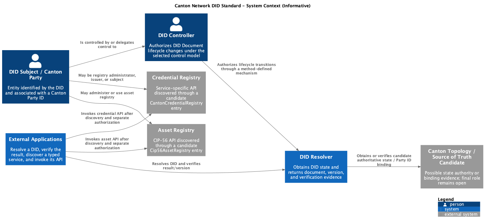
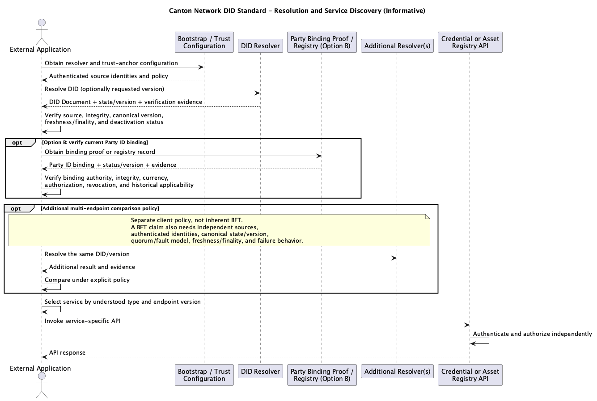

CIP: CIP TBD
Layer: Daml
Title: Canton Network DID Standard
Author:
License: CC0-1.0
Status: Early Draft
Type: Standards Track
Created: 2026-09-15

## Abstract

This CIP explores a Decentralized Identifier (DID) profile for Canton Network parties. It places public verification methods, verification relationships, and service discovery in DID Documents while leaving credentials responsible for assertions about subjects. It defines candidate document content, lifecycle requirements, resolution properties, and service entries for credential and asset registries. It deliberately leaves the DID method name, Party ID mapping, state authority, control model, topology linkage, endpoint shapes, migration, and Byzantine fault tolerance (BFT) semantics open.

The key words used in this document are category labels rather than RFC 2119 requirement terms:

- **Normative candidate** identifies text that could become an interoperability requirement after the open design decisions are resolved and the CIP progresses.
- **Open proposal** identifies a design option that is not yet selected and does not impose an implementation requirement.
- **Informative example** illustrates possible data or behavior and does not define conformance.

## Motivation

DID Documents are the semantically appropriate place to publish verification methods, relationships between keys and authorized operations, and `service` endpoints used to discover subject-associated services. Verifiable credentials carry assertions made by issuers about subjects. Using credentials as a generic service directory mixes assertion semantics with mutable operational discovery, complicates rotation and revocation, and can encourage unnecessary disclosure.

A Canton Party ID and a DID can be related without assuming they are identical. This draft uses `did:canton` only as a provisional **Open proposal** for examples. No DID method registration or reservation is claimed.

## Scope and Non-goals

### Normative candidate

The eventual standard would define:

- how a Canton party is associated with a DID;
- the authoritative state and verification process for a DID Document;
- document control, recovery, key rotation, and deactivation;
- current and historical resolution behavior;
- interoperable service discovery for selected Canton APIs; and
- migration and coexistence behavior for current discovery mechanisms.

### Non-goals

This draft does not:

- define a general credential data model or place credentials inside DID Documents;
- make a DID resolver an authorization server or a trust oracle for discovered services;
- equate Canton topology keys, participant keys, party authorization keys, and DID verification methods;
- prescribe KYC policy, credential issuance policy, or access-control policy for a discovered API;
- claim that multiple resolver endpoints inherently provide BFT; or
- claim that an existing CIP has approved migration to this design.

## Terminology

- **Canton Party ID**: a Canton party identifier, including its namespace component.
- **DID subject**: the entity identified by a DID. In this draft it can be associated with a Canton party.
- **DID controller**: an entity authorized by the selected control model to change DID state.
- **DID Document**: the resolved representation containing verification material, relationships, and services for a DID subject.
- **Verification method**: public material and metadata used to verify proofs. A method is not assumed to be a Canton participant key, topology signing key, or party authorization key.
- **Verification relationship**: a relationship such as `authentication`, `assertionMethod`, `capabilityInvocation`, or `capabilityDelegation` that identifies permitted uses of verification methods.
- **Resolver**: software that obtains DID state and produces a resolution result.
- **Trust anchor / state authority**: the source or rule by which a client decides which DID state and version are authoritative.
- **Service**: a discoverable endpoint description. Discovery does not grant authorization or establish the service's business trustworthiness.
- **Versioned resolution**: resolution that identifies the canonical state version and, where supported, resolves a specific historical version.

## Specification candidates

### Identifier and Party ID mapping

**Open proposal:** use `did:canton` as the method name. It is a placeholder in this draft and is neither reserved nor registered.

[DID Core DID Syntax](https://www.w3.org/TR/did-core/#did-syntax) defines a DID as `did:<method-name>:<method-specific-id>`. Its [Method Syntax requirements](https://www.w3.org/TR/did-core/#method-syntax) require each DID method specification to define how its `method-specific-id` is generated, including sensitivity, normalization, and uniqueness rules, and permit a method to define multiple method-specific identifier formats. A Canton DID method can therefore define one such format as a canonical encoding of a Canton Party ID. DID Core supplies the generic syntax and requirements for the method specification; it does not choose a Canton mapping, validate that a string is a Canton Party ID, or make any resulting association authoritative.

This draft keeps two first-class iteration paths open:

#### Option A: DID derived from a Canton Party ID

**Open proposal:** serialize the complete Party ID canonically and reversibly encode it as the `method-specific-id`. Given the contextual Party ID shape `party-hint::namespace/fingerprint`, an encoding has to preserve every component while preventing `/`, `?`, or `#` from being interpreted as DID URL delimiters. The exact Canton Party ID grammar has not been confirmed by this draft, so this shape is an input for design discussion rather than a normative grammar.

**Informative examples:** either a method-defined percent-encoding profile or a base encoding could produce identifiers shaped like:

```text
did:canton:party-hint::namespace%2Ffingerprint
did:canton:uQ2Fub25pY2FsUGFydHlJZEJ5dGVz
```

Both lines are syntactically valid under the generic DID Core ABNF. They are illustrative DID strings, not production encodings, test vectors, or evidence that the displayed Party ID shape is the complete Canton grammar. In the first example, `/` is percent-encoded because an unescaped slash starts a DID URL path rather than remaining in the `method-specific-id`; `::` is syntactically permitted, but its meaning would be defined only by the Canton DID method. A base-encoding profile would instead encode a canonical byte serialization of the complete Party ID and identify the exact base alphabet or multibase convention.

A real profile would define the canonical input serialization, character encoding, exact escaping or base alphabet, case handling, normalization, padding, maximum length, comparison rules, malformed-input rejection, and validation against the authoritative Party ID grammar. It would also provide round-trip test vectors proving both that decoding returns exactly the canonical Party ID and that re-encoding it returns exactly one canonical DID string. Percent encoding is usable only where the DID grammar permits it and needs one canonical representation so equivalent Party IDs cannot acquire different DIDs.

The party hint can have operational or human-facing stability different from the namespace or fingerprint. The final design needs to establish which parts identify the party, whether a hint change changes the Party ID, and consequently whether it changes the derived DID. It cannot infer those rules merely from the displayed text.

Deriving the DID from a Party ID derives only the identifier. It does not derive the DID Document. A resolver still needs an authoritative, authenticated, and versioned source for the controller, verification methods, verification relationships, service entries, and deactivation state.

Lifecycle implications include:

- a Party ID change produces a different derived DID unless the canonical Party ID definition says otherwise;
- participant or hosting changes need not change the DID, but the final method has to define whether and how they affect authoritative resolution state;
- namespace stability can give the identifier a stable anchor only to the extent guaranteed by the authoritative Canton semantics;
- topology changes can update resolved control or service state without changing the DID only under a defined state-authority and authorization model;
- deactivation needs durable method state because the identifier alone cannot communicate deactivation; and
- historical resolution needs to recover the document version that applied before key rotation, topology change, migration, or deactivation.

#### Option B: independent DID with a verifiable Party ID binding

**Open proposal:** create an independent DID and associate it with a Canton Party ID through a binding proof or authoritative registry record. The DID can then have a lifecycle independent from the textual Party ID, subject to the selected binding and control rules.

**Informative example:**

```text
did:canton:7K3p9wQ2mN4x
```

The value is an opaque example and does not define randomness, entropy, or encoding requirements. Resolution would return the DID Document, while a separate verifiable statement or registry lookup would establish the current Party ID binding.

This path adds indirection and another object whose issuance, authorization, update, revocation, historical availability, and trust anchor need definition. In return, it can support continuity when a Party ID changes and can separate DID recovery from Party ID text. Recovery remains security-sensitive: changing a controller, recovering DID control, and rebinding to another Party ID are distinct operations and need explicit authorization and audit semantics.

#### Comparison

| Concern | Option A: derived and reversible | Option B: independent with binding |
| --- | --- | --- |
| Initial association | Deterministic from a canonical Party ID; decoding can reveal the claimed Party ID without a binding lookup | Requires a verifiable binding proof or authoritative registry lookup before the Party association can be trusted |
| Primary advantage | Simple, inspectable association with no separate binding object to issue or recover | Identifier continuity and control recovery can be separated from changes to the Party ID text |
| Primary cost | Strict canonicalization and stronger coupling to Party ID identity and privacy properties | Additional indirection plus a binding object, verification path, governance, and lifecycle |
| Resolution state | Still requires an authoritative source for the DID Document; successful decoding does not authenticate document content | Requires an authoritative DID Document source plus authoritative binding evidence, which can be the same governed system only if specified |
| Identifier continuity | Follows the stability rules of the canonical Party ID, including the defined treatment of the hint, namespace, and fingerprint | Can remain stable across an authorized Party ID rebinding |
| Privacy and correlation | Exposes or reversibly reveals the Party ID and can make cross-context correlation easier | Can hide the Party ID from the DID string, although the binding, document, endpoints, and usage can still correlate it |
| Encoding and uniqueness | Requires exact serialization, escaping or base encoding, normalization, comparison, validation, uniqueness, and round-trip rules | Requires generation, entropy or allocation, collision handling, and uniqueness rules for an opaque identifier |
| Party and topology changes | A change to canonical Party identity produces a new DID; topology or hosting updates can preserve the DID only if the method's state rules permit it | Party changes can be represented by binding updates; topology and hosting changes can update binding or document state without changing the DID under defined authorization rules |
| Deactivation and history | Needs durable deactivation and historical document state; a decoder cannot infer either from the identifier | Needs durable DID deactivation, historical documents, and historical binding status so old proofs can be evaluated against the applicable Party association |
| Recovery | Depends on the authoritative document-control mechanism while the identifier remains tied to the Party ID | Can recover DID control independently, but controller recovery and Party rebinding need separate safeguards |
| Trust implications | Trust is concentrated in canonical Party ID interpretation, authoritative Canton identity semantics, and the source of resolved document state; reversibility alone proves no control | Adds trust in binding issuers, registry governance, or proof verification in addition to document resolution; clients must verify binding currency, authorization, and revocation |

A final choice could support one path or a precisely defined combination. This draft does not select one.

### DID Document data model

**Normative candidate:** a resolved document contains an `id`, one or more `controller` values, verification methods, the verification relationships used by the method, and zero or more structured `service` entries. Each verification method has a stable fragment identifier and identifies its controller. Verification material uses a representation allowed by the final profile.

**Informative example:**

```json
{
  "@context": ["https://www.w3.org/ns/did/v1"],
  "id": "did:canton:party-id-encoding-example",
  "controller": "did:canton:party-id-encoding-example",
  "verificationMethod": [
    {
      "id": "did:canton:party-id-encoding-example#operations-1",
      "type": "JsonWebKey2020",
      "controller": "did:canton:party-id-encoding-example",
      "publicKeyJwk": {
        "kty": "OKP",
        "crv": "Ed25519",
        "x": "11qYAYLef5WUf5mUmtlHUVPXmK9GnTf5h4L6F5J0M4A"
      }
    }
  ],
  "authentication": [
    "did:canton:party-id-encoding-example#operations-1"
  ],
  "assertionMethod": [
    "did:canton:party-id-encoding-example#operations-1"
  ],
  "capabilityInvocation": [
    "did:canton:party-id-encoding-example#operations-1"
  ],
  "service": [
    {
      "id": "did:canton:party-id-encoding-example#credential-registry",
      "type": "CantonCredentialRegistry",
      "serviceEndpoint": {
        "version": "1",
        "endpoints": [
          {
            "uri": "https://credentials.example.net/api/",
            "priority": 10
          }
        ]
      }
    },
    {
      "id": "did:canton:party-id-encoding-example#asset-registry",
      "type": "Cip56AssetRegistry",
      "serviceEndpoint": {
        "version": "1",
        "endpoints": [
          {
            "uri": "https://assets.example.net/api/",
            "priority": 10
          }
        ]
      }
    }
  ]
}
```

The strings, key material, versions, priorities, and URLs above are illustrative. `JsonWebKey2020` is not selected by this draft. A final profile needs to identify supported verification-method representations and cryptographic suites.

### Service entries

**Open proposal:** define service types named `CantonCredentialRegistry` and `Cip56AssetRegistry`. Prefer structured, explicitly versioned endpoint objects over bare URL strings so that future profiles can define priority, protocol, network, health, or capability metadata without parsing comma-separated values.

**Informative example:**

```json
{
  "id": "did:canton:party-id-encoding-example#credential-registry",
  "type": "CantonCredentialRegistry",
  "serviceEndpoint": {
    "version": "1",
    "endpoints": [
      {
        "uri": "https://credentials-a.example.net/v1/",
        "priority": 10
      },
      {
        "uri": "https://credentials-b.example.net/v1/",
        "priority": 20
      }
    ]
  }
}
```

Multiple entries can improve availability or enable client policy, but endpoint count alone says nothing about independent operation or consensus.

### Lifecycle and control

**Normative candidate:** any final method definition specifies:

- **Create:** how a DID, initial controller set, initial verification methods, and any Party ID binding become authoritative.
- **Read:** how clients resolve the canonical current state and verify its source, integrity, version, freshness, and finality.
- **Update:** how authorized controllers change verification relationships and service entries.
- **Deactivate:** how deactivation is represented, made durable, and distinguished from temporary resolution failure.
- **Controller authorization:** which proofs and threshold rules authorize each transition.
- **Recovery:** how control can be recovered after key loss or compromise, including limits and delays.
- **Key rotation:** how replacement, overlap, and compromise are represented without treating old signatures as newly invalid.
- **Historical verification:** how a verifier establishes which verification method and relationship applied when a proof was created.
- **Versioned resolution:** how a caller requests or identifies a state version and how canonical ordering or finality is determined.

These are requirements on the eventual design space. The mechanisms remain open.

### Canton topology and party namespace

**Open proposal:** use Canton topology or party-namespace evidence as one input to DID creation, binding, control, or resolution. A final design needs to state exactly which topology transactions or namespace authority are relevant, who can observe them, and how forks, migrations, and historical states are handled.

Canton topology, participant keys, party authorization keys, and DID verification methods have different scopes and lifecycles. Coincidental use of the same cryptographic key would not make these concepts equivalent. A binding needs explicit semantics and verifiable evidence.

### Resolution, bootstrap, and verifiable results

**Normative candidate:** a client can bootstrap a resolver and trust configuration, resolve a DID, and verify a result before consuming document content. A verifiable resolution result identifies at least the DID, canonical state or version, source or authority, integrity evidence, and applicable freshness or finality information. Failure behavior distinguishes not found, deactivated, stale, unverifiable, conflicting, and temporarily unavailable results.

Running or querying multiple resolvers or endpoints does not by itself provide BFT. Any BFT claim needs all of the following to be defined:

- independent sources or fault domains;
- authenticated source identities;
- a canonical state and version model;
- a quorum and fault model;
- freshness and finality rules; and
- deterministic behavior for missing, stale, invalid, and conflicting responses.

**Open proposal:** clients can apply an additional multi-endpoint comparison policy after bootstrap. That policy is not inherent to DID resolution and is not specified in this draft.



[PlantUML source for the system context diagram](images/did-system-context.puml)



[PlantUML source for the resolution sequence diagram](images/did-resolution-sequence.puml)

### Discovery flow

**Normative candidate:** service discovery follows this conceptual flow:

1. An application already knows or obtains the subject's DID through an application-specific trusted channel.
2. The application resolves the DID Document using its configured bootstrap and trust policy.
3. The application verifies the resolution result, canonical state or version, integrity evidence, freshness, finality, and deactivation status as defined by the selected method.
4. The application selects a `service` entry by an understood `type` and endpoint profile.
5. The application invokes the service-specific API.

DID resolution discovers an endpoint. The selected API separately authenticates callers, authorizes operations, establishes transport security, and applies domain trust policy. Presence in a DID Document does not prove that a registry assertion is true, compliant, safe, or available.

## Rationale

Separating assertions from discovery permits credential formats and registries to evolve independently from endpoint rotation. DID Documents provide explicit controller and verification relationships, while versioned resolution can support historical proof verification. Structured service entries avoid embedding an untyped directory inside credential claims and can evolve under named profiles.

The draft keeps Party ID mapping and state authority open because those choices determine privacy, portability, recovery, interoperability, and operational trust. Option A can remove binding lookup ambiguity but couples identifier continuity and correlation to canonical Party ID semantics. Option B can provide independent continuity and recovery but adds a binding lifecycle and trust dependency. Choosing either path, topology anchoring, or a separate state system has materially different consequences and needs evidence beyond this first draft.

This draft is informed by the [W3C DID Core specification](https://www.w3.org/TR/did-core/) and the [W3C DID Resolution specification](https://w3c.github.io/did-resolution/). It does not claim a particular publication status beyond what those sources state.

## Security and Privacy Considerations

Publishing a DID Document can enable public enumeration of parties, controllers, keys, service operators, and operational relationships. Deterministic Party ID mappings can increase correlation across applications, synchronizers, and time. Opaque identifiers do not eliminate correlation when controllers, verification methods, endpoint hosts, or usage patterns overlap.

Resolver compromise or controller compromise can substitute endpoints. Clients need authenticated resolution, downgrade protection for document versions and endpoint profiles, freshness and finality checks, and explicit behavior for stale or conflicting results. Resolver equivocation needs detectable evidence or a defined comparison and consensus policy; querying several URLs without source independence and a fault model is insufficient.

DID Documents are public discovery and verification metadata. They do not contain credentials, KYC documents, personal evidence, access tokens, bearer secrets, private keys, or API credentials. Service entries disclose the minimum routing information needed. APIs enforce their own authentication, authorization, rate limits, privacy policy, and data minimization.

Historical resolution can preserve accountability but can also preserve correlatable metadata. The final design needs retention and availability rules that balance proof verification, deactivation, legal obligations, and privacy.

## Backwards compatibility and migration

The current parallel credentials draft uses draft `cip-TBD` namespaced claims for registry URLs, issuer application URLs, and registry routes. These are referred to here as the current claims-URL discovery mechanism, without assigning that unnumbered draft the label CIP-204. CIP-56 defines metadata-based discovery for asset registry URLs, including metadata on a registry administrator party. Neither document is represented here as having decided to migrate to DID-based discovery.

**Open proposal:** existing claims and metadata discovery coexist with DID services during a transition. Clients could use one mechanism as bootstrap, compare both under an explicit policy, or select one by version or deployment profile. Precedence, conflict handling, downgrade protection, publication duration, and retirement criteria remain open. The final migration design needs to account for the current draft status and for the exact deployed CIP-56 metadata key spelling rather than silently normalizing it.

A DID profile can be additive if current identifiers and routes remain valid, but inconsistent endpoints across mechanisms can create substitution and downgrade risks. Compatibility therefore depends on a specified precedence and verification policy, not merely on retaining old fields.

## Reference implementation

No reference implementation exists for this Early Draft.

A useful prototype would include:

- a Party ID to DID mapping or binding-proof experiment;
- create, read, update, deactivate, recovery, and rotation test vectors;
- current and historical resolver responses with verifiable version metadata;
- negative cases for stale, conflicting, substituted, deactivated, and unverifiable results;
- typed service discovery for credential and CIP-56 asset registries; and
- interoperability tests across at least two independently implemented resolvers before making any resilience claim.

## Open decisions

1. **Method name:** whether to use `did:canton`, another method, or an existing DID method; registration and governance path.
2. **Option A, derived DID:** canonical Party ID grammar and serialization; method-specific encoding; round-trip and comparison rules; hint versus namespace stability; privacy and length limits; and which Party or topology changes create a new DID.
3. **Option B, independent DID:** identifier generation; binding-proof or registry format; binding issuer and trust anchor; update, revocation, rebinding, recovery, and historical evidence.
4. **Path selection:** whether deployments use Option A, Option B, or an explicitly distinguishable combination, and how clients determine which path applies. Both remain first-class iteration paths in this Early Draft.
5. **Trust anchor and state authority:** authoritative store or rule for DID Documents and, for Option B, bindings; bootstrap distribution, source authentication, canonical version, freshness, and finality.
6. **Control and lifecycle:** controller model, thresholds, create/update/deactivate authorization, recovery, compromise handling, key rotation, and the effect of Party, topology, and hosting changes under each option.
7. **Historical resolution:** version identifiers, retention, availability, proof-time semantics, old Party ID bindings, and deactivated-state handling.
8. **Service types and endpoint shape:** final type names, version negotiation, structured fields, multiple endpoints, and extension rules.
9. **Topology linkage:** exact relationship to Canton topology and party namespaces without conflating key roles; whether topology supplies document state, binding evidence, both, or neither.
10. **Migration:** coexistence with current claims-URL discovery and CIP-56 metadata, precedence, conflicts, downgrade protection, and retirement.
11. **BFT semantics:** whether BFT is in scope and, if so, independent sources, authenticated identities, canonical state, quorum/fault model, freshness/finality, and failure behavior.

## Copyright

This document is licensed under [CC0-1.0](https://creativecommons.org/publicdomain/zero/1.0/).

## Changelog

- 2026-09-15: Created parallel Early Draft with open mapping, lifecycle, resolution, service-discovery, migration, and security questions.
- 2026-09-15: Clarified DID Core method-specific identifier responsibilities and expanded the two first-class Party ID association options, examples, lifecycle, and trust comparison.
