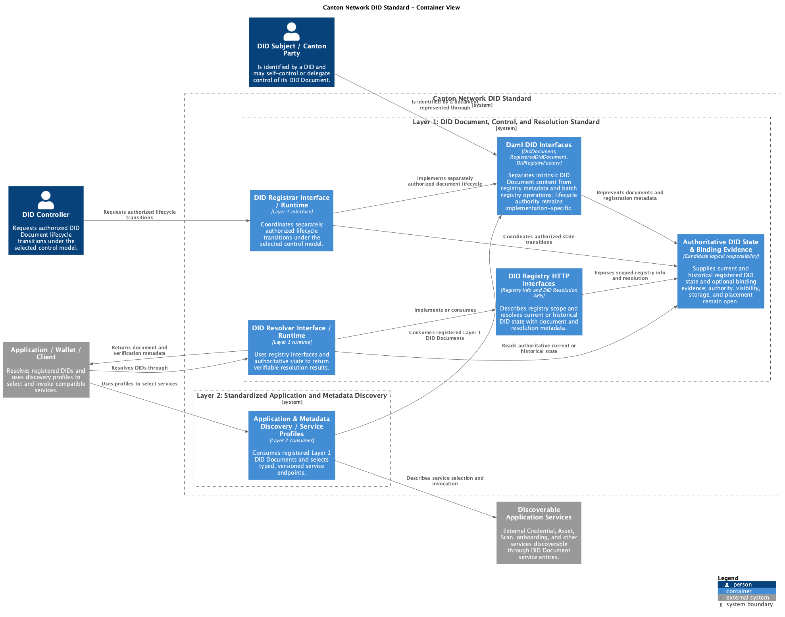

CIP: CIP TBD
Layer: Daml
Title: Canton Network DID Standard
Author:
License: CC0-1.0
Status: Early Draft
Type: Standards Track
Created: 2026-09-15

# Canton Network DID Standard

## Abstract

This CIP defines a Decentralized Identifier (DID) profile for Canton Network parties. It enables verifiable DID control and resolution, including current and historical state, and standardized discovery of Canton application services.

## Specification

This CIP consists of two generic layers, presented in dependency order:

1. **Layer 1: DID Document, Control, and Resolution Standard** defines the generic DID Document interface for associating DIDs with Canton parties, managing DID control and lifecycle, and resolving authoritative current or historical DID state.
2. **Layer 2: Standardized Application and Metadata Discovery** builds on Layer 1 by using DID Document `service` entries to publish versioned application endpoints, capabilities, routing information, and related metadata for discovery by compatible clients.

As an Early Draft, this CIP labels potential requirements as **Normative candidate**, unresolved designs as **Open proposal**, and non-conformant illustrations as **Informative example**.

### Architecture Overview (Non-Normative)

The System Context view treats the Canton Network DID Standard as one system and shows its two people and immediate external-system relationships. The Standard includes DID Document control and lifecycle, DID resolution, and discovery through DID Document `service` entries. A DID Subject may control its own DID Document or delegate control to a distinct DID Controller. Discoverable Application Services are represented as one category and may include DID Registries, Credential Registries, Asset Registries, and other application services.


*System Context for the Canton Network DID Standard and its external actors. [C4-PlantUML source](images/did-system-context.puml).*

The System Context elements below identify the people and external systems shown in the diagram.

| Element | Type | Diagram role or boundary |
| --- | --- | --- |
| DID Subject / Canton Party | Person | Entity identified by the DID and associated with a Canton Party ID; it may self-control or delegate control. |
| DID Controller | Person | Distinct role that authorizes DID Document lifecycle changes under the selected control model. |
| Canton Network DID Standard | System | Defines DID Document control and lifecycle, DID resolution, and discovery through DID Document `service` entries. |
| Discoverable Application Services | External system | Services made discoverable through DID Document `service` entries. Examples include DID Registries, Credential Registries, and Asset Registries. |

The standard is decomposed into two layers, presented in dependency order:

1. **Layer 1: DID Document, Control, and Resolution Standard.** This layer covers the DID-to-Canton-Party association, DID Document data model and verification methods, control, creation, update, rotation, recovery, deactivation, authoritative state, and current and historical resolution. A conforming design needs integrity, source authentication, canonical version, freshness, and finality rules. The DID state authority and its visibility boundary must be explicit: maintaining state does not imply universal visibility, and the final design must define which parties can maintain and observe DID-related state.
2. **Layer 2: Standardized Application and Metadata Discovery.** This layer uses DID Document `service` entries to publish versioned endpoint profiles, capabilities, and routing metadata. It defines how clients discover and select compatible application interfaces and how discovery mechanisms coexist, migrate, and resist downgrade. Resolver and registrar interfaces should interoperate with standards-aligned external tooling without requiring one identity-agent framework or inventing a Canton-specific agent model.

The boundary between on-ledger and off-ledger responsibilities is part of the architecture. A deployment can keep authoritative DID state or binding evidence on-ledger while exposing standards-aligned resolver and registrar interfaces off-ledger, but it must specify the authority, visibility, authentication, version, freshness, and finality properties of that boundary. Credential presentation and cryptographic credential verification occur outside the DID Document and can remain off-ledger. Applications can consume reduced outputs from separate verification or policy processes, but those outputs do not become DID Document or DID resolution semantics.

The Container view below summarizes the logical responsibilities defined or profiled by the Standard. The containers represent specification and interface boundaries rather than finalized deployment units. In particular, the authoritative store, authority and visibility model, and on-ledger/off-ledger placement remain open.



*Container view of logical boundaries in the Canton Network DID Standard; no storage or deployment topology is selected. [C4-PlantUML source](images/did-containers.puml).*

| Element | Type | Diagram role or boundary |
| --- | --- | --- |
| DID Subject / Canton Party | Person | Entity identified by the DID that may self-control its DID Document or delegate control. |
| DID Controller | Person | Role that requests authorized DID Document lifecycle transitions through the registrar. |
| Application / Wallet / Client | External system | Resolves DIDs and uses Layer 2 profiles to select and invoke compatible services. |
| Discoverable Application Services | External system | External DID Registries, Credential Registries, and Asset Registries described by resolved DID Document `service` entries. |
| DID Document & Control Model | Layer 1 container | Defines DID Document content, control, lifecycle, and authorized transitions. |
| DID Registrar Interface / Runtime | Layer 1 container | Accepts authorized lifecycle requests and coordinates state transitions under the selected control model. |
| Authoritative DID State & Binding Evidence | Layer 1 candidate responsibility | Supplies current and historical DID state and optional binding evidence; authority, visibility, storage, and placement remain open. |
| DID Resolver Interface / Runtime | Layer 1 container | Reads authoritative current or historical state and returns a verifiable resolution result. |
| Application & Metadata Discovery / Service Profiles | Layer 2 container | Defines how resolved `service` entries describe versioned endpoints, capabilities, selection, and routing metadata. |

### Layer 1: DID Document, Control, and Resolution Standard

This section deep-dives the DID Document and control model, registrar and resolver interfaces, and authoritative-state responsibility shown in the Container view.

#### Base DID Identifier and Document Standard

##### Identifier and Party ID Mapping

**Open proposal:** use `did:canton` as the method name. It is a placeholder in this draft and is neither reserved nor registered.

[DID Core DID Syntax](https://www.w3.org/TR/did-core/#did-syntax) defines a DID as `did:<method-name>:<method-specific-id>`. Its [Method Syntax requirements](https://www.w3.org/TR/did-core/#method-syntax) require each DID method specification to define how its `method-specific-id` is generated, including sensitivity, normalization, and uniqueness rules, and permit a method to define multiple method-specific identifier formats. A Canton DID method can therefore define one such format as a canonical encoding of a Canton Party ID. DID Core supplies the generic syntax and requirements for the method specification; it does not choose a Canton mapping, validate that a string is a Canton Party ID, or make any resulting association authoritative.

This draft keeps two first-class iteration paths open:

###### Option A: DID Derived from a Canton Party ID

**Open proposal:** use the complete canonical Canton Party ID directly as the `method-specific-id`. A Canton [`UniqueIdentifier`](https://github.com/digital-asset/canton/blob/main/community/base/src/main/scala/com/digitalasset/canton/topology/Identifier.scala) has the form `identifier::namespace`, where `::` is Canton's canonical delimiter. The `identifier` is at most 185 characters, conforms to LF Party ID constraints, and cannot contain `::`. In [party allocation](https://docs.daml.com/app-dev/parties-users.html), a supplied Party ID hint corresponds to this `identifier`. The `namespace` is represented by the fingerprint of the namespace public key, as described by Canton's [identity management documentation](https://docs.daml.com/canton/usermanual/identity_management.html). The normal current fingerprint form is 68 lowercase hexadecimal characters, commonly `1220` followed by 64 hexadecimal characters; this observation does not freeze that form as permanent grammar.

**Informative example:**

```text
UnlockIt-validator-1::1220671ca485c7bb9b4b45e8596dd71a6916a912899fe56fedf687a78cdbfa5e0624
did:canton:UnlockIt-validator-1::1220671ca485c7bb9b4b45e8596dd71a6916a912899fe56fedf687a78cdbfa5e0624
```

The complete Party ID after `did:canton:` is syntactically valid under the generic [DID Core method-specific identifier syntax](https://www.w3.org/TR/did-core/#did-syntax), including the `::`; no escaping or alternative base encoding is needed. Native Canton Party IDs do not admit `&`, so it is not needed for a valid native Canton Party ID. A literal `&` is valid in neither a native Canton Party ID identifier nor the DID Core `method-specific-id`; a hypothetical external value containing it would require percent-encoding as `%26`.

A real profile would validate the `identifier::namespace` input against authoritative Canton constraints, define canonical comparison and any applicable normalization, reject malformed input, and provide round-trip tests proving that removing the `did:canton:` prefix returns exactly the canonical Party ID and reapplying it returns exactly one canonical DID string.

This is only a candidate mapping. It does not define, register, reserve, or adopt `did:canton`, and it does not define resolution, a DID Document, or controller semantics. Deriving the DID from a Party ID derives only the identifier, not the DID Document. A resolver still needs an authoritative, authenticated, and versioned source for the controller, verification methods, verification relationships, service entries, and deactivation state.

Lifecycle implications include:

- a change to the canonical Party ID produces a different derived DID;
- deactivation needs durable method state because the identifier alone cannot communicate deactivation; and
- historical resolution needs to recover the document version that applied before key rotation, migration, or deactivation.

###### Option B: Independent DID with a Verifiable Party ID Binding

**Open proposal:** create an independent DID and associate it with a Canton Party ID through a binding proof or authoritative registry record. The DID can then have a lifecycle independent from the textual Party ID, subject to the selected binding and control rules.

**Informative example:**

```text
did:canton:7K3p9wQ2mN4x
```

The value is an opaque example and does not define randomness, entropy, or encoding requirements. Resolution would return the DID Document, while a separate verifiable statement or registry lookup would establish the current Party ID binding.

This path adds indirection and another object whose issuance, authorization, update, revocation, historical availability, and trust anchor need definition. In return, it can support continuity when a Party ID changes and can separate DID recovery from Party ID text. Recovery remains security-sensitive: changing a controller, recovering DID control, and rebinding to another Party ID are distinct operations and need explicit authorization and audit semantics.

###### Comparison

| Concern | Option A: derived and reversible | Option B: independent with binding |
| --- | --- | --- |
| Initial association | Deterministic from a canonical Party ID; decoding can reveal the claimed Party ID without a binding lookup | Requires a verifiable binding proof or authoritative registry lookup before the Party association can be trusted |
| Primary advantage | Simple, inspectable association with no separate binding object to issue or recover | Identifier continuity and control recovery can be separated from changes to the Party ID text |
| Primary cost | Strict canonicalization and stronger coupling to Party ID identity and privacy properties | Additional indirection plus a binding object, verification path, governance, and lifecycle |
| Resolution state | Still requires an authoritative source for the DID Document; successful decoding does not authenticate document content | Requires an authoritative DID Document source plus authoritative binding evidence, which can be the same governed system only if specified |
| Identifier continuity | Follows the stability of the canonical `identifier::namespace` Party ID | Can remain stable across an authorized Party ID rebinding |
| Privacy and correlation | Exposes the Party ID and can make cross-context correlation easier | Can hide the Party ID from the DID string, although the binding, document, endpoints, and usage can still correlate it |
| Encoding and uniqueness | Uses the canonical Party ID directly; requires validation, canonical comparison, malformed-input rejection, uniqueness, and round-trip rules | Requires generation, entropy or allocation, collision handling, and uniqueness rules for an opaque identifier |
| Party and topology changes | A change to canonical Party identity produces a new DID; topology or hosting updates can preserve the DID only if the method's state rules permit it | Party changes can be represented by binding updates; topology and hosting changes can update binding or document state without changing the DID under defined authorization rules |
| Deactivation and history | Needs durable deactivation and historical document state; a decoder cannot infer either from the identifier | Needs durable DID deactivation, historical documents, and historical binding status so old proofs can be evaluated against the applicable Party association |
| Recovery | Depends on the authoritative document-control mechanism while the identifier remains tied to the Party ID | Can recover DID control independently, but controller recovery and Party rebinding need separate safeguards |
| Trust implications | Trust is concentrated in canonical Party ID interpretation, authoritative Canton identity semantics, and the source of resolved document state; reversibility alone proves no control | Adds trust in binding issuers, registry governance, or proof verification in addition to document resolution; clients must verify binding currency, authorization, and revocation |

A final choice could support one path or a precisely defined combination. This draft does not select one.

##### DID Document Data Model

**Normative candidate:** a resolved document contains an `id`, one or more `controller` values, verification methods, the verification relationships used by the method, and zero or more structured `service` entries. Each verification method has a stable fragment identifier and identifies its controller. Verification material uses a representation allowed by the final profile.

A DID Document keeps public verification material separate from the relationships that authorize its use, such as `authentication`, `assertionMethod`, and `capabilityInvocation`. A service entry retains its own stable `id`, an understood `type`, and a `serviceEndpoint`; the final profile still needs to select verification-method representations, cryptographic suites, service types, and endpoint profiles. This draft intentionally does not prescribe a service-catalog payload or deployment URL.

#### Control and Resolution Standard

##### Lifecycle, Control, and Recovery

**Normative candidate:** any final method definition specifies:

- **Create:** how a DID, initial controller set, initial verification methods, and any Party ID binding become authoritative.
- **Read:** how clients resolve the canonical current state and verify its source, integrity, version, freshness, and finality.
- **Update:** how authorized controllers change verification relationships and service entries.
- **Deactivate:** how deactivation is represented, made durable, and distinguished from temporary resolution failure.
- **Controller authorization:** which proofs and threshold rules authorize each transition.
- **Recovery:** how control can be recovered after key loss or compromise, including limits and delays.
- **Key rotation:** how replacement, overlap, and compromise are represented without treating old signatures as newly invalid.
- **Historical verification:** how a verifier establishes which verification method and relationship applied when a proof was created.
- **Versioned resolution:** how a caller requests or identifies a state version and how canonical ordering or finality is determined.

These are requirements on the eventual design space. The mechanisms remain open.

##### Canton Topology and Party Namespace

**Open proposal:** use Canton topology or party-namespace evidence as one input to DID creation, binding, control, or resolution. A final design needs to state exactly which topology transactions or namespace authority are relevant, who can observe them, and how forks, migrations, and historical states are handled.

Canton topology, participant keys, party authorization keys, and DID verification methods have different scopes and lifecycles. Coincidental use of the same cryptographic key would not make these concepts equivalent. A binding needs explicit semantics and verifiable evidence.

##### Authoritative and Verifiable Resolution

**Normative candidate:** a client resolves a DID through a trusted resolver configuration and verifies the result before consuming document content. A verifiable resolution result identifies at least the DID, canonical state or version, source or authority, integrity evidence, and applicable freshness or finality information. Failure behavior distinguishes not found, deactivated, stale, unverifiable, conflicting, and temporarily unavailable results.

Running or querying multiple resolvers or endpoints does not by itself provide BFT. Any BFT claim needs all of the following to be defined:

- independent sources or fault domains;
- authenticated source identities;
- a canonical state and version model;
- a quorum and fault model;
- freshness and finality rules; and
- deterministic behavior for missing, stale, invalid, and conflicting responses.

**Open proposal:** clients can apply an additional multi-endpoint comparison policy. That policy is not inherent to DID resolution and is not specified in this draft.

#### Interfaces

Layer 1 defines candidate Daml interfaces for intrinsic DID Documents and registry metadata, plus HTTP interfaces for registry information and DID resolution. The directly consultable candidate source is [`demo/interface/daml/Canton/Network/Did/V1.daml`](demo/interface/daml/Canton/Network/Did/V1.daml); package status, build instructions, and unresolved implementation concerns are in [`demo/interface/README.md`](demo/interface/README.md). These interfaces do not select a DID method, registrar implementation, authoritative store, or controller model.

##### Daml Interfaces

###### DID Document Interface

`DidDocument` exposes a `DidDocumentView` containing an opaque `Did`, non-empty controllers, verification methods, verification relationship references, and typed, versioned service endpoints:

```daml
data DidDocumentView = DidDocumentView with
  id : Did
  controllers : NonEmpty Did
  verificationMethods : [VerificationMethod]
  verificationRelationships : VerificationRelationships
  services : [DidService]

interface DidDocument where
  viewtype DidDocumentView
```

The wrapper does not validate `did:canton` or any other method. Concrete implementations and profiles must define method-specific validation, verification-material types and cryptographic suites, JSON or JSON-LD contexts, external serialization and canonicalization, Party binding, controller and lifecycle authorization, and supported optional DID Core properties. The candidate interface deliberately has no generic archive or deactivate choice.

###### Registered DID Document Interface

`RegisteredDidDocument requires DidDocument` keeps intrinsic document content separate from registry metadata. Its registered view returns the intrinsic `DidDocumentView` alongside `DidRegistrationMetadata`, which records the registry administrator, registration and update times where available, version ID, deactivation state and time, source, integrity and finality evidence, and extensible metadata. Concrete implementations must keep that returned document consistent with the required `DidDocument` view.

```daml
interface RegisteredDidDocument requires DidDocument where
  viewtype RegisteredDidDocumentView

  nonconsuming choice RegisteredDidDocument_PublicFetch : RegisteredDidDocumentView
    with
      expectedRegistryAdmin : Party
      actor : Party
    controller actor
```

The choice checks that the result names `expectedRegistryAdmin`. It verifies a known disclosed contract at transaction time; it is not anonymous discovery and does not independently prove DID control, current freshness, finality, external publication, or HTTP caller identity.

###### DID Registry Factory Interface

`DidRegistryFactory` exposes `DidRegistryFactory_UpdateRegisteredDidDocuments`, a batch update of registration metadata for known `RegisteredDidDocument` contract IDs. Concrete implementations must authorize the actor, verify registry ownership, preserve intrinsic DID Document content unless a separately authorized lifecycle transition changes it, and reject inconsistent version, deactivation, time, source, integrity, finality, or authority metadata. Factory metadata updates are registry operations, not DID-controller authority.

##### HTTP Interfaces

The HTTP surface is a resolver and discovery boundary over registry-enabled documents. It does not imply that one registry is authoritative for every `did:canton` DID, make ledger data universally visible, or replace method-specific verification.

The DID HTTP surface uses a leading API version and a top-level DID collection. A future Layer 2 profile may select the API origin and root; this draft does not define that mechanism. Source, administrator, authority, and evidence remain resolution metadata rather than path components.

###### REST Resource Model Rationale

The HTTP contract uses `/v1` as one explicit leading version namespace. `/dids` is the primary top-level collection, and `/{did}` identifies a DID resource within it. Registry ID nesting is unnecessary for this candidate API and would add no information to the identified DID resource. The DID URI identifies the resource and HTTP `GET` supplies retrieval semantics without `/lookup` or `/resolve` action verbs. Path parameters identify resources, while query parameters select or modify retrieval and representation, as `partyId` and candidate `versionId` and `versionTime` parameters would.

DIDs, credentials, and assets retain distinct identifiers, representations, filters, lifecycle rules, and authorization semantics. Future credential and asset paths remain illustrative and are owned by their respective standards. This model applies the normative URI path hierarchy and query syntax of [RFC 3986 §3.3](https://www.rfc-editor.org/rfc/rfc3986.html#section-3.3) and [§3.4](https://www.rfc-editor.org/rfc/rfc3986.html#section-3.4), draws its resource-and-identifier architecture from [Fielding's REST §5.2.1.1](https://www.ics.uci.edu/~fielding/pubs/dissertation/rest_arch_style.htm#sec_5_2_1_1), and follows established resource-oriented conventions reflected in [Microsoft Azure API design guidance](https://learn.microsoft.com/azure/architecture/best-practices/api-design). RFC 3986 and REST do not formally mandate plural nouns, version-first URLs, descriptive parameter names, or verb-free paths; those are API design conventions applied here.

###### DID Lookup and Resolution API

The HTTP contract defines two resource families. `GET /v1/dids` and `GET /v1/dids/{did}` expose intrinsic `DidDocument` projections and do not require registration. `GET /v1/registered-dids` and `GET /v1/registered-dids/{did}` expose only contracts implementing both `DidDocument` and `RegisteredDidDocument`, composed using identical contract ID. The registered collection may be filtered with `partyId`; the intrinsic collection cannot because the Party association is registration metadata. Both direct single-PQS collections support `state=active|archived|all` (default active), half-open effective-time filters (`createdFrom` and `archivedFrom` inclusive, `>=`; `createdUntil` and `archivedUntil` exclusive, `<`; intervals with `From >= Until` are invalid; either archive filter excludes active rows), and lifecycle metadata separate from registration deactivation. Registered joins require compatible creation events as well as identical contract IDs, and compatible archive events for archived rows. Collections use zero-based `page` and `pageSize`, default 50 and maximum 100, fetch at most `pageSize + 1`, and return `items`, `snapshotOffset`, `nextPageToken`, `page`, `pageSize`, and `hasNext`, without `observedAt`. Results are ordered by DID and contract ID. A fresh request selects and validates the latest PQS bigint offset. The HMAC-authenticated `nextPageToken` alone continues by keyset; token plus explicit `page` performs an OFFSET jump within the same snapshot. Repeated filters and page size must match or be omitted. Tokens bind resource, query, snapshot and expiry; expired or invalid tokens and unavailable snapshots fail explicitly. There is no separate snapshot token. `GET /v1/dids/capabilities` advertises these listings and the singular-only BFT boundary.

An intrinsic HTTP record contains `contractId`, clear `did`, and `didDocument`. A registered record contains `contractId`, clear `did`, `didDocument`, and a separate `registration` object. HTTP composition does not nest or copy the intrinsic Daml view into the registered Daml view and does not change `RegisteredDidDocument requires DidDocument`. Deployment exposure, authentication, authorization, audience, and access filtering remain implementation concerns.

The normative HTTP contract is the local [DID API v1 OpenAPI source](demo/interface/openapi/did-v1.yaml), with `/v1` as its canonical base path. The demo supports active singular resolution and historical collections through the public PQS 3.5 `active`, `creates`, and `archives` functions. Historical singular resolution remains a distinct future capability. Collections are not BFT quorum reads.

For both item families, `{did}` occupies exactly one path segment and does not accept a DID URL containing a path, query, or fragment.

For this draft, clients generate the canonical `{did}` segment by UTF-8 encoding the DID and percent-encoding every byte except URI unreserved characters (`ALPHA`, `DIGIT`, `-`, `.`, `_`, and `~`), using uppercase hexadecimal digits in percent escapes. RFC 3986 permits literal `:` characters within a path segment, but this profile emits them as `%3A` to provide one deterministic, router-safe cache and resource identity. For example:

```text
DID:     did:canton:alice::1220abcd
segment: did%3Acanton%3Aalice%3A%3A1220abcd
```

A server decodes the segment exactly once, rejects malformed percent escapes, preserves the decoded DID text without normalization, validates it as the intended canonical base DID, and rejects a decoded `/`, `?`, or `#`. It then re-encodes the decoded DID with this profile's canonical uppercase percent-encoder and requires byte-for-byte equality with the supplied segment, rejecting noncanonical or double-encoded spellings. It never recursively decodes. Candidate `versionId` and `versionTime` query parameters may request historical state, but their exact syntax, precedence, and support remain open.

Future standards could retain compatible registry-scoped shapes such as `/v1/registries/{registryId}/credentials/...` and `/v1/registries/{registryId}/assets/...`. These paths are illustrative, not normative in this DID standard. Adopting either collection requires separate compatibility work in its owning standard, which retains authority over item identifiers and operations; this draft does not assert a `/credentials/{id}` or `/assets/{id}` lookup model.

A successful intrinsic response returns clear `did` and `didDocument` fields. A successful registered response adds a separate `registration` object for registry state and evidence. This HTTP schema is not a direct JSON encoding of either Daml view:

| Surface | Purpose | Boundary |
| --- | --- | --- |
| `DidDocumentView` | Intrinsic on-ledger interface view | Uses candidate Daml types and package identity; no JSON/JSON-LD mapping is selected. |
| DID Document JSON or JSON-LD | External interoperable document | Requires a profile-defined context, representation, validation, and canonicalization. |
| `DidRegistrationMetadata` / `registration` | Registry and document state | Registered HTTP records carry this separately from intrinsic document content. |
| Resolution evidence | Resolver result and verification evidence | Registered response registration fields may carry source, integrity, and finality evidence without changing intrinsic content. |

The OpenAPI contract defines invalid input, token integrity/expiry/resource/query/snapshot errors, not found, duplicate active DID, and PQS unavailability. Collection lifecycle state comes from PQS events, not inferred registration deactivation. Historical singular resolution, stale or unverifiable results, authorization, and rate-limit outcomes remain distinct capability concerns.

Resolver and registrar interoperability remains defined at supported interface boundaries. Implementations can use external agent, wallet, or application tooling, or implement those interfaces directly. Registrars submit or coordinate transitions under the Layer 1 control model, while resolvers return verifiable current or historical state. Neither role gains authority merely by implementing an interface.

#### Visibility and Publication Boundaries

The DID state authority and deployment profile must define which parties can maintain and observe DID-related state. Publication of a DID Document can make its controllers, verification methods, services, and operational relationships visible; authoritative maintenance does not imply universal visibility, and an off-ledger interface does not change the underlying authority or publication boundary.

#### Security Considerations

Publishing a DID Document can enable public enumeration of parties, controllers, keys, service operators, and operational relationships. Deterministic Party ID mappings can increase correlation across applications, synchronizers, and time. Opaque identifiers do not eliminate correlation when controllers, verification methods, endpoint hosts, or usage patterns overlap.

Resolver compromise or controller compromise can substitute endpoints. Clients need authenticated resolution, downgrade protection for document versions and endpoint profiles, freshness and finality checks, and explicit behavior for stale or conflicting results. Resolver equivocation needs detectable evidence or a defined comparison and consensus policy; querying several URLs without source independence and a fault model is insufficient.

DID Documents are public discovery and verification metadata. They do not contain credentials, KYC documents, personal evidence, access tokens, bearer secrets, private keys, or API credentials. Service entries disclose the minimum routing information needed. APIs enforce their own authentication, authorization, rate limits, privacy policy, and data minimization.

Historical resolution can preserve accountability but can also preserve correlatable metadata. The final design needs retention and availability rules that balance proof verification, deactivation, legal obligations, and privacy.

### Layer 2: Standardized Application and Metadata Discovery

This section deep-dives the Application & Metadata Discovery / Service Profiles boundary and the Discoverable Application Services shown in the Container view.

#### Service and Application Discovery

**Normative candidate:** DID Document `service` entries use stable service identifiers, understood service types, and structured, explicitly versioned endpoint data. A compatible client can select an entry without parsing an untyped URL list. Multiple entries can support availability or client policy, but endpoint count alone says nothing about independent operation or consensus.

DID resolution can discover an endpoint. The selected API separately authenticates callers, authorizes operations, establishes transport security, and applies domain trust policy. Presence in a DID Document does not prove that a service is authorized, trustworthy, available, or suitable for a caller.

#### Party-to-DID Resolution and Verified Binding

Where an application begins with a Canton Party ID rather than a DID, it follows the selected Layer 1 association path. Option A derives and validates the DID using the canonical mapping. Option B obtains and verifies a current Party-to-DID binding from its defined authority before resolving the DID Document. A syntactically valid mapping, binding, or DID Document does not authenticate a discovered API, authorize an operation, or establish business trust.

### Resolver and Service Discovery

**Open question:** how clients obtain an authoritative resolver and any deployment-specific service-discovery configuration remains unresolved and is outside the Java demo. This draft does not define that mechanism. Any future profile must preserve the Layer 1 DID authority model and must not treat discovery as authorization.

The candidate DID API comprises intrinsic `GET /v1/dids` and `GET /v1/dids/{did}` resources plus registered `GET /v1/registered-dids` and `GET /v1/registered-dids/{did}` resources. The conditional `partyId` filter applies to the registered collection. Credential and asset operations remain owned by their respective standards.

## Motivation

DID Documents are the semantically appropriate place to publish verification methods, relationships between keys and authorized operations, and `service` endpoints used to discover subject-associated services. Verifiable credentials carry assertions made by issuers about subjects. Using credentials as a generic service directory mixes assertion semantics with mutable operational discovery, complicates rotation and revocation, and can encourage unnecessary disclosure.

A Canton Party ID and a DID can be related without assuming they are identical. This draft uses `did:canton` only as a provisional **Open proposal** for examples. No DID method registration or reservation is claimed.

## Rationale

### Use-Case and Design Requirements

Separating assertions from discovery permits credential formats and registries to evolve independently from endpoint rotation. DID Documents provide explicit controller and verification relationships, while versioned resolution can support historical proof verification. Structured service entries avoid embedding an untyped directory inside credential claims and can evolve under named profiles.

The draft keeps Party ID mapping and state authority open because those choices determine privacy, portability, recovery, interoperability, and operational trust. Option A can remove binding lookup ambiguity but couples identifier continuity and correlation to canonical Party ID semantics. Option B can provide independent continuity and recovery but adds a binding lifecycle and trust dependency. Choosing either path, topology anchoring, or a separate state system has materially different consequences and needs evidence beyond this first draft.

This draft is informed by the [W3C DID Core specification](https://www.w3.org/TR/did-core/) and the [W3C DID Resolution specification](https://w3c.github.io/did-resolution/). It does not claim a particular publication status beyond what those sources state.

The architecture also adapts relevant historical input from the CC0 [Vera proposal at commit `6e8e6da7511fbf91f666c9b4c01291d0913848c9`](https://github.com/unlockitio/canton-dev-fund/blob/6e8e6da7511fbf91f666c9b4c01291d0913848c9/proposals/vera.md), including explicit DID state authority and visibility boundaries, standards-aligned resolver and registrar interfaces, and the on-ledger/off-ledger boundary. Vera is reference input, not an approved standard or evidence of a conforming implementation. Its credential lifecycle, verification outcomes, business policy, funding, and delivery milestones are not imported into this DID standard.

#### Visibility Use Cases and Boundaries (Informative)

A public DID can support broadly discoverable verification methods and application endpoints, but public resolution also increases correlation and enumeration risk. A deployment can instead limit publication or access to DID state, provided it states who can maintain and observe that state and how authorized clients obtain verifiable results. Public, restricted, and off-ledger access paths do not change the requirement to authenticate authority, version, freshness, finality, and deactivation state.

#### Decisions, Alternatives, and Deferred Questions

The draft retains Party-derived and independent DIDs as first-class alternatives because they make different choices about correlation, continuity, recovery, and binding trust. It likewise leaves the authoritative state store, topology linkage, exact publication boundary, deployment-specific discovery surface, service profiles, migration, and any BFT model open. These alternatives are candidate design work, not evidence that `did:canton` is approved or registered.

## Scope and Non-Goals

### Normative Candidate

The eventual standard would define:

- how a Canton party is associated with a DID;
- the authoritative state and verification process for a DID Document;
- document control, recovery, key rotation, and deactivation;
- current and historical resolution behavior;
- interoperable service discovery for selected Canton APIs; and
- migration and coexistence behavior for current discovery mechanisms.

### Non-Goals

This draft does not:

- define a general credential data model or place credentials inside DID Documents;
- make a DID resolver an authorization server or a trust oracle for discovered services;
- equate Canton topology keys, participant keys, party authorization keys, and DID verification methods;
- prescribe KYC policy, credential issuance policy, or access-control policy for a discovered API;
- claim that multiple resolver endpoints inherently provide BFT; or
- claim that an existing CIP has approved migration to this design.

## Backwards Compatibility

No migration from an existing discovery mechanism is defined by this draft. Coexistence, precedence, conflict handling, downgrade protection, publication duration, and retirement criteria remain deferred until an authoritative resolver and service-discovery design is selected. Existing identifiers, metadata, and routes remain governed by their owning standards.

## Reference Implementation

The checked-in [`demo/interface/`](demo/interface/) package is candidate Daml interface source only. It is not a conforming registry, resolver, registrar, deployment discovery service, or deployed service. No conforming reference implementation exists for this Early Draft.

The checked-in non-normative [`demo/`](demo/) is an executable local Canton/PQS vertical slice for the four candidate read operations: intrinsic `GET /v1/dids` and `GET /v1/dids/{did}`, plus registered `GET /v1/registered-dids` and `GET /v1/registered-dids/{did}`. A concrete demo Daml template creates Alice and Bob contracts on a local ledger. The Java 21 Quarkus 3.23.2 API reads active `DidDocument` projections directly for intrinsic resources and joins active `DidDocument` and `RegisteredDidDocument` projections by identical contract ID for registered resources. Its concrete template, signatory and visibility model, use of `registration.registryAdmin` as a demo Party association, fixture values, storage choice, collection envelope, status codes, and error body are architectural demonstration choices. They add no normative requirements and claim no deployed service, authoritative Party association, DID control, integrity, freshness, finality, or production cryptography. See the demo README for the exact operator workflow and boundaries.

Conformance and maturity need to distinguish three categories:

- **Standard requirements:** selected, testable behavior promoted from a normative candidate after the relevant open decisions are resolved.
- **Architectural choices:** deployment-specific selections, including the state store, visibility mechanism, and integration framework, documented without presenting them as universal requirements.
- **Deferred work:** unresolved open proposals or capabilities intentionally left for later iterations, which cannot be claimed as implemented or conforming.

The Java demo deliberately implements only the candidate current-state reads. Further prototype work remains unresolved and includes:

- an authoritative Party ID to DID mapping or binding-proof model;
- create, update, deactivate, recovery, rotation, and history semantics;
- current and historical resolver responses with authoritative version evidence;
- additional resolver profiles and lifecycle-specific statuses and error schemas beyond the active-read OpenAPI contract;
- cryptographic suites, key representation, authentication, and authorization;
- negative cases for stale, conflicting, substituted, deactivated, and unverifiable results;
- typed service discovery for credential and CIP-56 asset registries;
- finality semantics and evidence; and
- interoperability tests across independently implemented resolvers before making any resilience claim.

## Copyright

This document is licensed under [CC0-1.0](https://creativecommons.org/publicdomain/zero/1.0/).

## Changelog

- 2026-09-15: Created parallel Early Draft with open mapping, lifecycle, resolution, service-discovery, migration, and security questions.
- 2026-09-15: Clarified DID Core method-specific identifier responsibilities and expanded the two first-class Party ID association options, examples, lifecycle, and trust comparison.
- 2026-09-17: Reorganized the architecture into Layer 1 DID control and resolution and Layer 2 application and metadata discovery; kept deployment discovery unresolved; added Vera provenance, authority and visibility boundaries, interface and ledger boundaries, and conformance maturity criteria.
- 2026-09-17: Aligned the document structure and reading flow with the Canton Network Credentials Standard while retaining DID-specific semantics and open decisions.
- 2026-09-21: Removed the premature concrete deployment-discovery proposal and retained resolver and service discovery as an open question outside the demo.

## Appendix: Open Issues and Deferred Decisions

1. **Method name:** whether to use `did:canton`, another method, or an existing DID method; registration and governance path.
2. **Option A, derived DID:** whether to adopt the direct canonical `identifier::namespace` mapping; final validation, normalization, comparison, and round-trip rules; privacy and length limits; and the effect of future Canton Party ID grammar changes.
3. **Option B, independent DID:** identifier generation; binding-proof or registry format; binding issuer and trust anchor; update, revocation, rebinding, recovery, and historical evidence.
4. **Path selection:** whether deployments use Option A, Option B, or an explicitly distinguishable combination, and how clients determine which path applies. Both remain first-class iteration paths in this Early Draft.
5. **Trust anchor and state authority:** authoritative store or rule for DID Documents and, for Option B, bindings; resolver configuration, source authentication, canonical version, freshness, and finality.
6. **Control and lifecycle:** controller model, thresholds, create/update/deactivate authorization, recovery, compromise handling, key rotation, and the effect of Party, topology, and hosting changes under each option.
7. **Historical resolution:** version identifiers, retention, availability, proof-time semantics, old Party ID bindings, and deactivated-state handling.
8. **Serialization, interfaces, and services:** verification-material type and cryptographic suites; DID external JSON or JSON-LD serialization and canonicalization; HTTP historical-resolution parameters and error schema; final service-type names and registration; version negotiation, endpoint fields, and extension rules.
9. **Topology linkage:** exact relationship to Canton topology and party namespaces without conflating key roles; whether topology supplies document state, binding evidence, both, or neither.
10. **Migration:** coexistence with existing discovery and metadata mechanisms, precedence, conflicts, downgrade protection, and retirement.
11. **BFT semantics:** whether BFT is in scope and, if so, independent sources, authenticated identities, canonical state, quorum/fault model, freshness/finality, and failure behavior.
12. **Resolver and service discovery:** how clients obtain an authoritative resolver and any deployment-specific discovery configuration.
13. **On-ledger/off-ledger boundary:** which DID or binding state is maintained on-ledger, which interfaces and proof-processing steps run off-ledger, and how clients authenticate and correlate the two without importing credential semantics into DID resolution.
